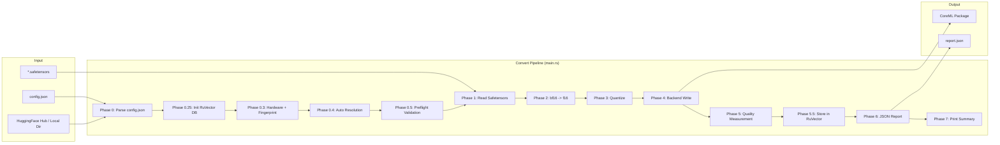
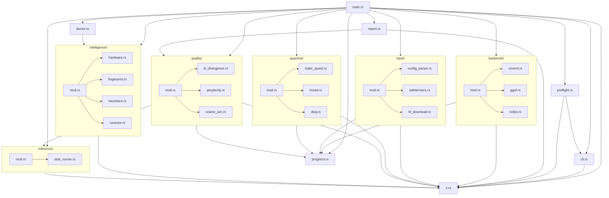
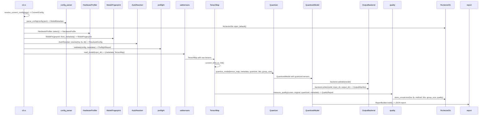
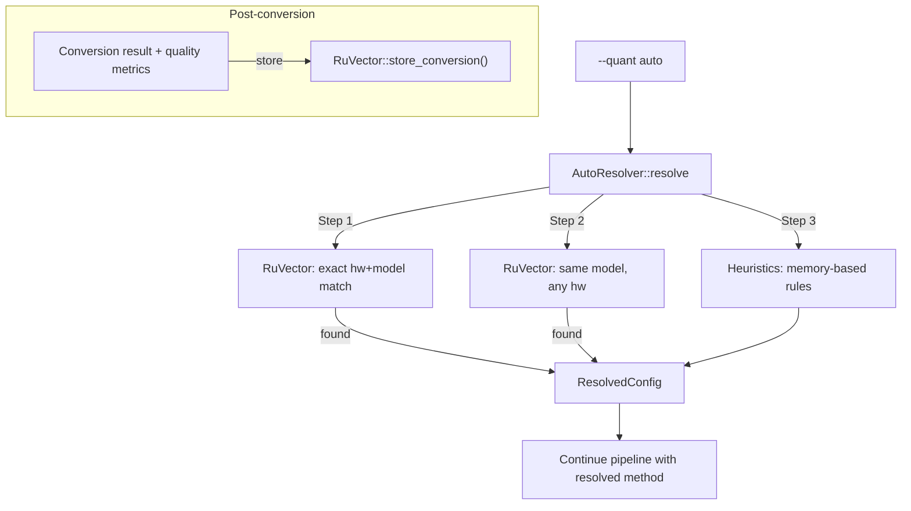

# hf2q Architecture

## 1. Overview

hf2q is a pure Rust CLI tool that converts HuggingFace model weights to hardware-optimized formats. It eliminates Python from the model conversion pipeline entirely, providing a single binary that reads safetensors, quantizes weights, and writes output in formats optimized for specific hardware targets.

### Design Philosophy

- **Zero Python**: The entire conversion pipeline runs in Rust. No Python interpreter, no pip dependencies, no virtualenvs.
- **Pipeline architecture**: Data flows linearly through well-defined phases. Each phase has a single responsibility and clear input/output contracts.
- **Trait-based extensibility**: New output formats and quantization methods are added by implementing traits (`OutputBackend`, `Quantizer`), not by modifying existing code.
- **IR as central contract**: The Intermediate Representation (`TensorMap`, `ModelMetadata`, `QuantizedModel`) is the shared language between all pipeline stages. Input modules produce it, quantizers transform it, backends consume it.
- **Self-learning auto mode**: The tool remembers conversion results in a local vector database (RuVector) and uses past outcomes to recommend optimal settings for future conversions.
- **Feature-gated optional dependencies**: Heavy platform-specific dependencies (coreml-native, ruvector-core) are behind cargo feature flags. The core pipeline works without them.

### Current State

- ~16,600 lines of Rust across 25+ source files
- One implemented output backend: CoreML
- Four quantization families: static (f16/q8/q4/q2), mixed-bit, DWQ, auto
- 54+ tests across all modules
- Targets Apple Silicon (macOS) as primary platform

---

## 2. System Architecture

### High-Level Pipeline



### Module Dependency Graph



---

## 3. Module Structure

### Entry Point (`main.rs`)

Dispatches clap subcommands (`convert`, `info`, `doctor`, `completions`) and owns the 7-phase convert pipeline. Contains the `AppError` enum that classifies errors into exit code categories. Installs a SIGINT handler that cleans up partial output directories on Ctrl+C.

### CLI (`cli.rs`)

Pure configuration module. Uses clap derive API to define the full argument schema. Contains:

- `Cli` / `Command` -- top-level parser and subcommand enum
- `ConvertArgs` -- all convert subcommand arguments
- `OutputFormat` enum -- `Coreml`, `Gguf`, `Nvfp4`, `Gptq`, `Awq`
- `QuantMethod` enum -- `Auto`, `F16`, `Q8`, `Q4`, `Q2`, `Q4Mxfp`, `Mixed26`, `Mixed36`, `Mixed46`, `DwqMixed46`
- `GroupSize` enum -- `G32`, `G64`, `G128`
- `ConvertConfig` -- resolved configuration struct that flows through the pipeline
- `resolve_convert_config()` -- validates and resolves CLI args into `ConvertConfig`
- `parse_sensitive_layers()` -- parses layer range specifications like `"13-24"` or `"1,5,13-24"`

No global state. All environment variable resolution happens here at startup.

### IR (`ir.rs`)

The Intermediate Representation module defines the central data types that flow between pipeline stages:

- `DType` -- tensor element types (F32, F16, BF16, I32, I64, U8, U16, U32, Bool)
- `TensorRef` -- a single tensor with name, shape, dtype, and data bytes
- `TensorMap` -- `HashMap<String, TensorRef>`, the primary container for model weights
- `ModelMetadata` -- architecture info parsed from config.json
- `QuantizedTensor` -- a tensor after quantization, with per-tensor quant metadata
- `TensorQuantInfo` -- per-tensor quantization parameters (method, bits, group_size, scales, biases)
- `QuantizedModel` -- the fully quantized model, ready for backend consumption
- `OutputManifest` -- list of files written by a backend
- `FormatWarning` / `WarningSeverity` -- backend validation warnings

All types are `Send + Sync`. `TensorRef` provides `is_weight()` to determine which tensors should be quantized versus preserved at full precision. Non-weight tensors include layernorms, biases, scalars, router scales, and embeddings.

### Input (`input/`)

- `config_parser.rs` -- parses HuggingFace `config.json` into `ModelMetadata`
- `safetensors.rs` -- reads `.safetensors` files into `TensorMap` using memory-mapped I/O (memmap2)
- `hf_download.rs` -- downloads models from HuggingFace Hub using the `hf-hub` crate

### Backends (`backends/`)

- `mod.rs` -- defines the `OutputBackend` trait and `BackendError` enum
- `coreml.rs` -- CoreML model package output
- `gguf.rs` -- GGUF format (planned, stub)
- `nvfp4.rs` -- NVFP4 format (planned, stub)

### Quantize (`quantize/`)

- `mod.rs` -- defines the `Quantizer` trait, `LayerQuantConfig`, and the `quantize_model()` orchestrator
- `static_quant.rs` -- round-to-nearest quantization for f16, q8, q4, q2
- `mixed.rs` -- mixed-bit quantization with per-layer bit allocation based on `--sensitive-layers`
- `dwq.rs` -- Distilled Weight Quantization with calibration passes via `InferenceRunner`

### Quality (`quality/`)

- `mod.rs` -- orchestrates quality measurement, defines `QualityReport`
- `kl_divergence.rs` -- KL divergence between original and quantized logits/activations
- `perplexity.rs` -- perplexity delta measurement
- `cosine_sim.rs` -- cosine similarity of per-layer activations

### Intelligence (`intelligence/`)

- `mod.rs` -- `AutoResolver` with RuVector-first, heuristic-fallback resolution
- `hardware.rs` -- `HardwareProfiler` detecting chip model, memory, core counts via sysinfo
- `fingerprint.rs` -- `ModelFingerprint` from `ModelMetadata` for stable model identification
- `heuristics.rs` -- rule-based quantization selection based on memory fitting analysis
- `ruvector.rs` -- `RuVectorDb` JSON-backed store for conversion results with exact/similar match lookups

### Inference (`inference/`)

- `mod.rs` -- `InferenceRunner` trait, `TokenInput`, `ForwardOutput` types, `create_runner()` factory
- `stub_runner.rs` -- stub runner (no inference backend currently available)

### Supporting Modules

- `preflight.rs` -- pre-conversion validation (input dir, layer types, format compatibility, sensitive layer ranges, disk space, output dir)
- `progress.rs` -- progress bars and terminal UX via indicatif/console
- `report.rs` -- JSON report builder with stable v1 schema for CI consumption
- `doctor.rs` -- system health diagnostics (RuVector, hardware detection, disk space)

---

## 4. Data Flow

### Convert Pipeline Data Transformations



### Type Flow Through Pipeline

```
config.json  -->  ModelMetadata
                      |
                      v
*.safetensors --> TensorMap (HashMap<String, TensorRef>)
                      |
                      | convert_bf16_to_f16()
                      v
                  TensorMap (all f16)
                      |
                      | quantize_model(quantizer, bits, group_size)
                      v
                  QuantizedModel { metadata, tensors: HashMap<String, QuantizedTensor>, ... }
                      |
                      | backend.write()
                      v
                  OutputManifest { files: Vec<OutputFile>, total_size_bytes, ... }
```

---

## 5. Intermediate Representation

### TensorRef

The fundamental unit of model weight data:

```rust
pub struct TensorRef {
    pub name: String,        // e.g., "model.layers.0.self_attn.q_proj.weight"
    pub shape: Vec<usize>,   // e.g., [4096, 4096]
    pub dtype: DType,        // e.g., DType::F16
    pub data: Vec<u8>,       // raw bytes, may originate from mmap
}
```

Key method: `is_weight()` determines whether a tensor should be quantized. Returns `false` for layernorms, biases, scalars, router scales, and embeddings. Returns `true` for multi-dimensional tensors whose name contains "weight", "proj", or "experts.".

### TensorMap

A `HashMap<String, TensorRef>` that serves as the primary model weight container. Provides:

- `convert_bf16_to_f16()` -- in-place bf16-to-f16 conversion of all bf16 tensors
- `total_size_bytes()` -- sum of all tensor data sizes
- Standard HashMap operations via the `tensors` field

### ModelMetadata

Architecture metadata extracted from `config.json`:

```rust
pub struct ModelMetadata {
    pub architecture: String,       // "Gemma4ForConditionalGeneration"
    pub model_type: String,         // "gemma4"
    pub param_count: u64,           // total parameter count
    pub hidden_size: u64,
    pub num_layers: u32,
    pub layer_types: Vec<String>,   // per-layer type names
    pub num_attention_heads: u32,
    pub num_kv_heads: Option<u32>,  // for GQA
    pub vocab_size: u64,
    pub dtype: String,
    pub shard_count: u32,
    pub num_experts: Option<u32>,   // MoE
    pub top_k_experts: Option<u32>, // MoE
    pub intermediate_size: Option<u64>,
    pub raw_config: serde_json::Value,  // passthrough for output
}
```

### QuantizedTensor and QuantizedModel

After quantization, each tensor becomes a `QuantizedTensor` with its own `TensorQuantInfo` recording the quantization parameters (method, bits, group_size, scales, biases, preserved flag). These are collected into a `QuantizedModel` alongside global quant metadata.

### OutputManifest

Produced by backends after writing. Lists all output files with sizes, enabling the JSON report and summary display.

---

## 6. Quantization Subsystem

### Quantizer Trait

```rust
pub trait Quantizer: Send + Sync {
    fn name(&self) -> &str;
    fn requires_calibration(&self) -> bool;
    fn quantize_tensor(
        &self,
        tensor: &TensorRef,
        config: &LayerQuantConfig,
    ) -> Result<QuantizedTensor, QuantizeError>;
}
```

The `quantize_model()` orchestrator iterates tensors in sorted order (for deterministic output), applies `LayerQuantConfig` per tensor (setting `preserve: true` for non-weight tensors via `is_weight()`), and calls `quantize_tensor()` for each.

### Static Quantization (`static_quant.rs`)

Round-to-nearest quantization supporting f16, q8, q4, and q2 bit widths. Non-weight tensors are passed through at their original precision. Weight tensors are quantized per-group: data is divided into groups of `group_size` elements, each group gets its own scale factor stored alongside the quantized values.

### Mixed-Bit Quantization (`mixed.rs`)

Assigns different bit widths per layer. Layers specified in `--sensitive-layers` ranges get higher precision (6 bits), while other layers get lower precision (2, 3, or 4 bits depending on the method variant):

| Method | Base bits | Sensitive bits |
|--------|-----------|----------------|
| `mixed-2-6` | 2 | 6 |
| `mixed-3-6` | 3 | 6 |
| `mixed-4-6` | 4 | 6 |

### DWQ -- Distilled Weight Quantization (`dwq.rs`)

The most sophisticated quantization method. Requires an inference backend. Uses a calibration process with configurable sample count (`--calibration-samples`, default 1024). The `DwqConfig` struct controls calibration parameters. DWQ uses layer-streaming to bound memory usage: it loads one layer at a time via `InferenceRunner::load_layer()`, runs calibration forward passes, and writes the quantized layer before moving to the next.

### Quantization Dispatch

The `cmd_convert` function in `main.rs` dispatches to the correct quantizer based on `QuantMethod`:

- `F16`, `Q8`, `Q4`, `Q2` -- `StaticQuantizer`
- `Mixed26`, `Mixed36`, `Mixed46` -- `MixedBitQuantizer` through `quantize_model()`
- `DwqMixed46` -- `DwqQuantizer` through `run_dwq_calibration()`
- `Auto` -- resolved to one of the above via `AutoResolver` before reaching this dispatch

---

## 7. Output Backends

### OutputBackend Trait

```rust
pub trait OutputBackend: Send + Sync {
    fn name(&self) -> &str;
    fn validate(&self, model: &QuantizedModel) -> Result<Vec<FormatWarning>, BackendError>;
    fn write(
        &self,
        model: &QuantizedModel,
        input_dir: &Path,
        output_dir: &Path,
        progress: &ProgressReporter,
    ) -> Result<OutputManifest, BackendError>;
}
```

Every backend validates before writing. Validation returns non-fatal `FormatWarning`s or fatal `BackendError`s.

### CoreML Backend (`coreml.rs`)

Writes a CoreML model package. Validates that the model is not MoE (CoreML does not support dynamic expert routing). Uses the `coreml-native` crate when the `coreml-backend` feature is enabled.

### Planned Backends

- `gguf.rs` -- GGUF format for llama.cpp ecosystem
- `nvfp4.rs` -- NVIDIA FP4 format

Both exist as stubs with `#[allow(dead_code)]`.

---

## 8. Intelligence / Auto Mode

### Architecture



### AutoResolver

Resolution order:

1. Query RuVector for an exact hardware+model match (same chip model, same total memory, same core count, same model architecture/params/layers)
2. Query RuVector for a similar match (same model on different hardware)
3. Fall back to rule-based heuristics

The resolver produces a `ResolvedConfig` containing the recommended `quant_method`, `bits`, `group_size`, a `confidence` score (0.0-1.0), the `source` (RuVectorExact, RuVectorSimilar, or Heuristic), and human-readable `reasoning`.

### HardwareProfiler (`hardware.rs`)

Detects the current machine via `sysinfo`:

- **Chip model**: on macOS, reads `machdep.cpu.brand_string` via sysctl for Apple Silicon identification
- **Memory**: total and available unified memory in bytes
- **Cores**: performance vs efficiency core counts via `hw.perflevel0/1.logicalcpu_max` on macOS

Produces a `HardwareProfile` with a `stable_id()` based on chip model, total memory, and core count (excludes available memory, which fluctuates).

### ModelFingerprint (`fingerprint.rs`)

Creates a stable, hashable identifier from `ModelMetadata`. Includes architecture name, total params, layer count, expert count, attention types, hidden size, dtype, intermediate size, head counts, and vocab size. Used as the key for RuVector lookups.

Provides `estimated_f16_size_bytes()` and `estimated_size_bytes(bits)` for memory fitting calculations.

### Heuristics (`heuristics.rs`)

Memory-fitting rules with 1.3x headroom factor (1.8x for "generous" headroom):

| Rule | Condition | Result | Confidence |
|------|-----------|--------|------------|
| 1 | f16 fits with 1.8x headroom | `f16` | 0.90 |
| 2 | f16 fits with 1.3x headroom | `q8` | 0.75 |
| 3 | q8 fits with 1.3x headroom | `mixed-4-6` | 0.70 |
| 4 | q4 fits with 1.3x headroom | `q4` | 0.65 |
| 5 | q2 fits with 1.3x headroom | `q2` | 0.50 |
| 6 | Nothing fits | Error | -- |

The memory budget is `max(available_memory, total_memory * 0.7)` to account for reclaimable OS file caches.

### RuVector (`ruvector.rs`)

A JSON-backed store at `~/.hf2q/ruvector/` that persists conversion records:

```rust
pub struct ConversionRecord {
    pub hardware: HardwareProfile,
    pub fingerprint: ModelFingerprint,
    pub quant_method: String,
    pub bits: u8,
    pub group_size: usize,
    pub quality: QualityMetrics,     // kl_divergence, perplexity_delta, cosine_similarity
    pub hf2q_version: String,
    pub timestamp: String,
    pub needs_recalibration: bool,
}
```

Query behavior:

- **Exact match**: same `stable_id()` for both hardware and model fingerprint
- **Similar match**: same model fingerprint on any hardware
- **Best selection**: among matches, prefers lowest KL divergence, then lowest perplexity delta
- **Version gating**: records from different hf2q versions are flagged `needs_recalibration` and excluded from queries

When the `ruvector` cargo feature is enabled, the crate additionally wraps `ruvector-core` for vector similarity search across hardware/model configurations.

---

## 9. Quality Measurement

Quality measurement compares original and quantized model outputs using three metrics. Requires an inference backend; without one, quality measurement is skipped with a clear message.

### Process

1. Load original weights into `InferenceRunner`
2. Run forward pass on calibration tokens (32-token synthetic sequence) to get original logits and per-layer activations
3. Load quantized weights
4. Run the same forward pass to get quantized logits and activations
5. Compute metrics by comparing the two sets of outputs

### KL Divergence (`kl_divergence.rs`)

Measures the divergence between probability distributions of original and quantized logits. Also computed per-layer from activation vectors. Lower is better; thresholds for display: green < 0.01, yellow < 0.1, red >= 0.1.

### Perplexity Delta (`perplexity.rs`)

Measures the change in perplexity (next-token prediction quality). Uses calibration tokens shifted by 1 as targets. Reports pre-quant perplexity, post-quant perplexity, and the delta. Thresholds: green < 0.5, yellow < 2.0, red >= 2.0.

### Cosine Similarity (`cosine_sim.rs`)

Measures per-layer activation similarity between original and quantized models. Reports average, minimum, and the index of the worst layer. Thresholds: green > 0.99, yellow > 0.95, red <= 0.95.

### QualityReport

All metrics are collected into a `QualityReport` struct with `Option<f64>` fields (allowing partial measurement when some computations fail). The report feeds into both the terminal summary and the JSON report.

---

## 10. CLI Design

### Commands

| Command | Description |
|---------|-------------|
| `hf2q convert` | Convert a model to a hardware-optimized format |
| `hf2q info` | Inspect model metadata without converting |
| `hf2q doctor` | Diagnose system health (RuVector, hardware, Metal, disk) |
| `hf2q completions` | Generate shell completions (bash, zsh, fish, powershell) |

### Key Convert Flags

| Flag | Type | Default | Description |
|------|------|---------|-------------|
| `--input` | `PathBuf` | -- | Local safetensors directory (conflicts with `--repo`) |
| `--repo` | `String` | -- | HuggingFace repo ID for automatic download |
| `--format` | `OutputFormat` | required | Output target: `coreml` (more planned) |
| `--quant` | `QuantMethod` | `auto` | Quantization method |
| `--sensitive-layers` | `String` | -- | Layer ranges for higher precision (e.g., `"13-24"`) |
| `--calibration-samples` | `u32` | 1024 | Sample count for DWQ calibration |
| `--bits` | `u8` | method default | Custom bit width (2-8) |
| `--group-size` | `GroupSize` | 64 | Group size: `32`, `64`, `128` |
| `--output` | `PathBuf` | auto-generated | Output directory |
| `--json-report` | `bool` | false | Emit structured JSON report |
| `--skip-quality` | `bool` | false | Skip quality measurement |
| `--dry-run` | `bool` | false | Print plan and exit without converting |
| `--yes` | `bool` | false | Non-interactive mode |
| `--unsupported-layers` | `Policy` | -- | `passthrough` to pass unsupported layers at f16 |
| `-v` / `-vv` / `-vvv` | -- | warn | Verbosity: info / debug / trace |

### Config Resolution

`resolve_convert_config()` in `cli.rs` transforms `ConvertArgs` into `ConvertConfig`:

1. Resolves input path (local dir or HF Hub download)
2. Parses `--sensitive-layers` into `Vec<RangeInclusive<usize>>`
3. Resolves group size (default: 64)
4. Auto-generates output directory name as `{model}-{format}-{quant}` if not specified
5. Validates that the chosen quant method and output format are implemented
6. Returns the fully resolved `ConvertConfig` that flows through the pipeline

---

## 11. Error Handling

### Error Classification

```rust
enum AppError {
    Input(anyhow::Error),         // exit code 3
    Conversion(anyhow::Error),    // exit code 1
    QualityExceeded(anyhow::Error), // exit code 2
    Interrupted,                   // exit code 1
}
```

### Exit Codes (per FR39 spec)

| Code | Meaning | When |
|------|---------|------|
| 0 | Success | Conversion completed |
| 1 | Conversion error | Quantization failure, backend write failure, interruption |
| 2 | Quality exceeded | Quality threshold breached (future use) |
| 3 | Input/validation error | Bad config, missing files, invalid args, preflight failure |

### Error Strategy by Module

- **main.rs**: `anyhow::Result` at the top level, classified into `AppError` for exit code mapping
- **ir.rs**: `thiserror`-derived `IrError` for type-safe tensor operation errors
- **backends/**: `BackendError` with `UnsupportedFormat`, `ValidationFailed`, `WriteFailed`, `Io`, `Serialization`
- **quantize/**: `QuantizeError` with `TensorQuantizeFailed`, `UnsupportedMethod`, `GroupSizeMismatch`
- **quality/**: `QualityError` wrapping inference, KL, perplexity, and cosine sim errors
- **intelligence/**: `IntelligenceError` composing hardware, fingerprint, heuristics, and RuVector errors
- **inference/**: `InferenceError` for platform, loading, forward pass, and logits extraction errors
- **preflight/**: `PreflightError` with detailed, actionable error messages including suggested fixes

All error messages include context and remediation guidance. The preflight module is particularly thorough, providing multi-line error messages with explicit fix instructions.

### Graceful Interruption

A Ctrl+C handler installed via the `ctrlc` crate sets an `AtomicBool` flag. The pipeline checks `check_interrupted()` between phases. On interruption, the handler cleans up partial output directories (only if created by the current run, not pre-existing).

---

## 12. Feature Flags

Defined in `Cargo.toml`:

| Feature | Dependency | Purpose |
|---------|------------|---------|
| `coreml-backend` | `coreml-native` | CoreML output backend |
| `ruvector` | `ruvector-core` | Enhanced vector similarity search for auto mode |

### Conditional Compilation

- `intelligence/ruvector.rs`: `cfg!(feature = "ruvector")` reports feature status in diagnostics; the JSON-backed store works without the feature, but vector similarity search requires it
- `backends/coreml.rs`: CoreML-specific functionality gated behind `coreml-backend`

The default feature set is empty (`default = []`). The core pipeline (read, quantize static methods) works without any optional features.

---

## 13. Future Architecture

### Inference Engine (`hf2q serve`)

A planned inference server with an OpenAI-compatible API. Will use the same `InferenceRunner` trait infrastructure, adding:

- HTTP server (likely axum or actix-web)
- OpenAI-compatible `/v1/chat/completions` and `/v1/completions` endpoints
- KV cache management
- Continuous batching
- Model loading from hf2q output directories

### Additional Model Architectures

Priority order:

1. **Gemma 4 MoE** -- currently the primary test target
2. **Llama** -- LlamaForCausalLM
3. **Mistral** -- MistralForCausalLM
4. Additional architectures as demand dictates

Architecture support is primarily a `config_parser.rs` concern (parsing architecture-specific config.json fields) and a `TensorRef::is_weight()` concern (knowing which tensor name patterns to quantize).

### Additional Output Backends

| Backend | Target | Status |
|---------|--------|--------|
| GGUF | llama.cpp, ollama | Stub exists |
| NVFP4 | NVIDIA TensorRT | Stub exists |
| GPTQ | GPU inference engines | CLI enum defined |
| AWQ | Activation-aware quantization | CLI enum defined |
| ROCm | AMD GPU inference | Planned |
| OpenVINO | Intel inference | Planned |

### Linux / NVIDIA Platform Support

Currently macOS-only for CoreML output. Future Linux support would add:

- CUDA-based inference runner
- NVIDIA-specific output formats (NVFP4, TensorRT)
- Cross-platform hardware profiling (NVIDIA GPU detection via nvidia-smi or NVML)

---

## 14. Dependencies

### Core (always included)

| Crate | Version | Role |
|-------|---------|------|
| `safetensors` | 0.7 | Reading `.safetensors` weight files |
| `half` | 2.4 | bf16/f16 numeric types and conversion |
| `hf-hub` | 0.5 | HuggingFace Hub model downloads |
| `clap` | 4.5 | CLI argument parsing (derive API) |
| `clap_complete` | 4.5 | Shell completion generation |
| `rayon` | 1.10 | Data-parallel processing |
| `memmap2` | 0.9 | Memory-mapped file I/O for safetensors |
| `indicatif` | 0.17 | Progress bars |
| `console` | 0.15 | Terminal styling (colors, bold) |
| `serde` | 1 | Serialization framework |
| `serde_json` | 1 | JSON parsing and generation |
| `anyhow` | 1 | Top-level error handling with context |
| `thiserror` | 2 | Typed error derivation for library-level modules |
| `sysinfo` | 0.32 | Hardware detection (CPU, memory, disks) |
| `ctrlc` | 3.4 | SIGINT handling with process termination |
| `tracing` | 0.1 | Structured logging |
| `tracing-subscriber` | 0.3 | Log subscriber with env-filter |

### Optional

| Crate | Feature Flag | Role |
|-------|-------------|------|
| `coreml-native` | `coreml-backend` | CoreML model compilation and export |
| `ruvector-core` | `ruvector` | Vector similarity search for auto mode |

### Dev / Test

| Crate | Role |
|-------|------|
| `assert_cmd` | CLI integration testing |
| `predicates` | Output assertion matching |
| `tempfile` | Temporary directory management in tests |
| `criterion` | Benchmarking (`quantize_bench`, `shard_read_bench`) |
