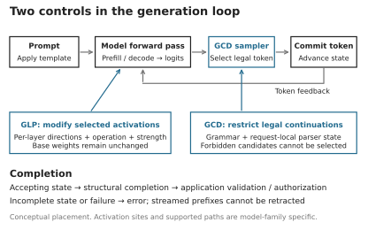
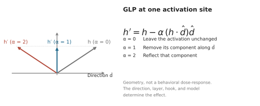
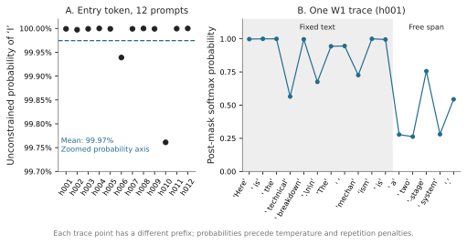
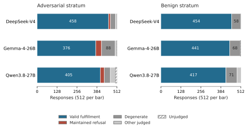

# GCD and GLP in hf2q: Controlling Local Inference

*Robert E. Lee · IOActive*

## Abstract

Local inference gives operators control over model execution, but behavioral
steering and output constraints address different problems. This paper examines
grammar-constrained decoding (GCD) and GGUF Layer Projection (GLP), connecting
their mechanisms to hf2q, a Rust and MLX-native inference stack for Apple
Silicon. GCD restricts generation to a specified language; GLP distributes
layer-specific activation interventions separately from unchanged base weights.
We distinguish structural validity, refusal suppression, and authorization,
and explain why grammar membership and numerical steering correctness do not
establish semantic correctness. A source-level implementation account covers
grammar enforcement, schema compilation, model-family hooks, and calibration.
A historical grammar campaign covers a 1,024-prompt corpus across three model
families; its low judge-labeled refusal rates coexist with substantial
budget-limited generation and weaknesses in the original scoring procedure.
A subsequent 48-prompt GLP evaluation finds no observed refusal reduction
for one candidate direction across four intervention strengths. An operational
battery passes its final 17 named checks. These records illustrate why
output-language enforcement, correct steering arithmetic, and useful model
behavior require distinct evidence.

## Introduction

Local execution gives operators control over weights, inference, and
applications. Changing model behavior and constraining an agent's actions
still require distinct controls.

Two techniques make that distinction useful in practice. **Grammar-constrained
decoding (GCD)** restricts the continuations a model can generate.
**GGUF Layer Projection (GLP)** packages a small activation-steering
intervention that a compatible runtime applies during inference. Both can
operate with the original model weights unchanged. GCD defines an allowed
output language; GLP changes part of the computation that produces the
next-token scores.[^1][^2][^3]

hf2q brings these controls to local inference on Apple Silicon. This article
connects their mechanisms to the implementation and a refusal-control case
study, with implications for structured output, authorization, and intervention
distribution.

## Two controls, two responsibilities

A model produces **logits**: one score for each candidate next token. Sampling
turns those scores into a token choice. The selected token becomes part of
the context used to predict the next one.

GLP intervenes inside the forward computation, modifying activations at
selected layers. GCD intervenes at token selection, excluding candidates
that would violate the active grammar. Neither is a filter that rewrites a
finished answer.

*Table 1. Comparison of grammar constraints and projective activation steering.*

| Property | GCD | GLP in projective mode |
|---|---|---|
| Control artifact | Grammar, or a schema compiled into a grammar | Directions with operation and compatibility metadata |
| Intervention | Restrict candidate tokens | Modify selected activations |
| Base weights | Unchanged | Unchanged |
| Scope | Output language for a request or generation region | Bound model, selected layers and activation sites |
| Guarantee | Language membership on successful completion, subject to correct enforcement | Numerical transformation, subject to correct arithmetic and application site |
| Requires evaluation | Usefulness, completion, cost, and policy correctness | Behavioral effect, capability, and compatibility |

*Figure 1. The two intervention points. Prefill processes the prompt; decoding
extends the generated sequence. Token selection occurs when the model produces
the first generated token and at subsequent generation steps. The diagram
shows conceptual placement, not a claim that every model family has identical
activation sites or execution paths.*

## GCD: make the output language explicit

A grammar defines a set of strings. A JSON grammar might permit well-formed
JSON; a more specific grammar might permit only an object with particular
keys, types, and enumerated values. GCD carries that definition into token
selection instead of asking the model to remember a formatting instruction.
Prior research and implementations already use this mechanism for structured
NLP tasks, code, and structured generation.[^1][^4]

At a given output prefix, the decoder determines which next tokens can extend
that prefix toward a string in the grammar's language. Invalid candidates
are masked. The runtime advances the grammar state after each committed
token, including when a word or grammar terminal spans multiple tokens.
End-of-generation is allowed only at an accepting state.

For a simplified softmax-and-mask decoder, let $u$ be the generated prefix,
$A_G(u)$ the admissible next-token set, and $p(t\mid u)$ the model's
next-token distribution, with the prompt held fixed. Then:

$$
\begin{aligned}
Z(u)&=\sum_{v\in A_G(u)}p(v\mid u),\\
q(t\mid u)&=\frac{p(t\mid u)\,\mathbf{1}[t\in A_G(u)]}{Z(u)}.
\end{aligned}
$$

The expression assumes $Z(u)>0$. A decoder with no usable legal continuation
must fail rather than emit outside the constraint. Temperature, penalties,
and candidate truncation affect the actual selection distribution; the
security requirement is that none of those operations restore an invalid
candidate to the selectable set.

Masking changes probabilities by removing alternatives and renormalizing the
survivors. At a fixed prefix, this simple mask preserves the relative odds of
the surviving tokens. Across a whole response, however, the imposed choices
change subsequent context. Local masking also does not generally sample from
the model's original distribution conditioned on the *entire completed
response* satisfying the grammar. Grammar-aligned decoding research examines
that distinction and its quality consequences.[^5]

### From structure to authorization

Vince Ovando's *Constitutive Authorization at the Decoding Boundary* applies
GCD to a security boundary: construct a grammar from the authenticated
principal's permitted actions. For example, a support agent could be allowed
to send a report only to an enumerated internal destination. If all permitted
outputs name that destination, an instruction embedded in a retrieved email
cannot make the decoder generate another destination through that field.[^2]

The critical relationship is:

$$
\begin{aligned}
\operatorname{decode}(\text{completed output})&\in L(G_s)\\
&\subseteq\operatorname{Authorized}(s).
\end{aligned}
$$

Here $s$ is trusted authorization state. The grammar must faithfully represent
that state, token handling must preserve its intended meaning, and every
relevant output path must enforce the constraint. A grammar supplied by the
untrusted caller is not an authorization boundary against that caller.

Ovando calls this **constitutive** enforcement: unauthorized outputs are
excluded during their construction. A downstream whitelist is
**corrective**: it receives a generated action and checks whether execution
is permitted. Both can express a positive policy. The distinction is when
the policy is enforced, rather than whether a downstream control can ever
be secure.

The supplied June 26, 2026 draft reports zero observed bypass in its covered
GCD attack arms, including approximately 868,000 trials. That is evidence
from the Tantalus study, not an hf2q benchmark. Its formal argument is
conditional on the compiler, tokenizer, and enforcement assumptions; a
finite collection of successful trials cannot establish those assumptions
for another implementation.[^2]

The boundary is deliberately narrow. An authorized recipient can still receive
incorrect content. A free-text message can still disclose information that
its recipient should not see. A syntactically valid command can still be the
wrong command for the task. Applications need their own authorization and
validation at execution, including checks on actual resource resolution,
redirects, and current state. GCD can reinforce those controls at generation.

### Three applications of the same mechanism

These uses should not be conflated:

*Table 2. Three applications of grammar constraints and their remaining limits.*

| Application | What is enforced | What remains open |
|---|---|---|
| Schema-constrained output | Representable object structure and supported value constraints | Truth and usefulness of field contents |
| Refusal-suppression grammar | A specified opening, alphabet, and excluded textual patterns | Paraphrase, evasion, task completion, and correctness |
| Authorization grammar | An action language compiled from trusted permitted actions | Correct policy construction and safe execution of permitted actions |

A refusal lexicon remains a lexical blacklist even when it is enforced during
decoding. It is different from an action whitelist. The common machinery is
the grammar-aware decoder; the policy carried by the grammar determines what
the control means.

## GLP: distribute the intervention separately

A familiar way to distribute an altered model is to edit the original weights
and publish another complete checkpoint. A compact behavioral change can
therefore require downloading almost all of the original model again.

GLP separates those things. A compatible runtime loads the original model and
a much smaller artifact containing steering directions and the information
needed to apply them. For the operator, this resembles attaching a patch to
a shared base model. Mechanically, projective GLP modifies activations while
the model runs; it is not a binary diff applied to the stored weight tensors.
With fresh inference state, disabling the intervention restores unsteered
computation on the original weights. Existing KV or recurrent state can retain
the effects of earlier steering and must be reset for that comparison.[^3]

GLP names a format, not a single file or a universal vector. Weightless
publishes checkpoint-specific artifacts under `msuiche/` on Hugging Face,
including multiple interventions for the same checkpoint. Their sizes vary
with layer coverage and activation width: kilobytes or megabytes of directions
can accompany gigabytes of base weights. GLP-29 for DeepSeek-V4-Flash-0731
is one example; that checkpoint also has a distinct residual-site GLP-42.
Compatibility and behavioral claims belong to the selected artifact.[^3]

Matt Suiche's [weightless project](https://weightless.msuiche.com/) develops
and distributes this approach. Its GLP format builds on the GGUF control-vector
convention, adding explicit operation and compatibility metadata. The
important distinction is between **additive steering**, which adds a vector,
and **projective steering**, which removes a component of the current
activation. An additive consumer can accept a projective artifact's names,
dtypes, and shapes without error, yet push activations along the direction
instead of removing their component. This silent failure motivates
`glp.mode`: a conforming reader must reject an operation it does not
implement.[^3]

### The projection

Let $h$ be an activation at the selected site, $\hat d$ a unit direction,
and $\alpha$ the intervention strength. Projective GLP applies:

$$
h' = h-\alpha(h^\top\hat d)\hat d.
$$

The dot product measures how much of $h$ lies along the direction. At
$\alpha=1$, the operation removes that component. At $\alpha=0$, it leaves
$h$ unchanged. At $\alpha=2$, it reflects the component across the
perpendicular subspace. Increasing the strength is therefore not a promise
of steadily improving behavioral results. Strength needs validation for the
particular checkpoint, activation site, and output regime. Strength travels
separately in `glp.alpha_default` or a runtime override such as `--glp-alpha`.
It must not be baked into projective direction tensors: scaling a raw
direction by $s$ scales $(h^\top d)d$ by $s^2$, whereas a consumer that
normalizes the direction, as hf2q does, erases that baked-in scale.[^3]

*Figure 2. Projective GLP at one activation site. This is a geometric
illustration of the equation, not an empirical refusal curve. Behavioral
effects depend on where the direction is applied and require empirical
evaluation.*

Research by Arditi and colleagues showed that a direction in the residual
activations mediated refusal in the models they studied. That provides a
mechanistic basis for interventions of this kind. It does not establish one
universal direction, nor prove that removing refusal improves reasoning or
preserves every capability.[^6]

### Operation and delivery are separate axes

Additive versus projective describes the **operation**. Applying it directly
to activations versus representing it through model parameters describes
**delivery**. Parameter updates can be merged into weights (baking) or loaded
as unmerged adapters. These axes are independent of the
dense-versus-mixture-of-experts (MoE) distinction.

*Table 3. Steering operation and delivery. Exactness refers to the stated local computation, subject to numerical precision; behavioral effectiveness requires separate evaluation.*

| Operation | Runtime activation intervention | Parameter representation or baking |
|---|---|---|
| Additive | Add a fixed vector at the declared site; possible in dense and MoE models | Exact through a matching writable bias; a bias-free LoRA cannot supply a nonzero constant shift for arbitrary inputs |
| Projective | Remove or rescale a directional component at the declared site; possible in dense and MoE models | Exact at a matching linear writer through a rank-at-most-one update; whole-residual equivalence needs additional conditions |

**Runtime.** Both operations can act on an exposed residual activation
regardless of whether dense or routed expert blocks produced its contributions.
The arithmetic does not require editing each expert. Integration still depends
on the architecture's actual tensors and execution order: hf2q's Qwen residual
hook and DeepSeek FFN-writer hook are distinct contracts. Neither exact
addition nor exact projection guarantees the intended behavior.[^12]

**Parameter representation.** Write $P_\alpha=I-\alpha\hat d\hat d^\top$.
For an affine writer $h=Wx+b$, applying $P_\alpha$ is exactly represented by
$W'=P_\alpha W$ and $b'=P_\alpha b$. The matrix change
$\Delta W=-\alpha\hat d(\hat d^\top W)$ has rank at most one, so it admits
a low-rank adapter (LoRA) representation. A constant addition $h'=h+v$
instead corresponds to $b'=b+v$ when an editable bias exists at that exact
site. A bias-free LoRA supplies $\Delta W x$; it cannot equal nonzero $v$
for arbitrary $x$, as $x=0$ demonstrates.[^19]

A nearly constant feature can support an approximation: if $a^\top x\approx c$
for nonzero $c$, then $\Delta W=va^\top/c$ gives $\Delta W x\approx v$.
This depends on constancy at the adapter's input, not merely a large activation
outlier. Massive activations have been observed in dense models and Mixtral;
their existence does not establish a universal additive-to-LoRA conversion
or a dense-only boundary.[^20]

**Whole-residual equivalence is a stronger claim.** For $h=r+Wx$, changing
only $W$ leaves $r$ untouched, whereas runtime projection also transforms $r$.
Arditi et al.'s equivalence proof covers unit-strength removal of one direction
with all preceding residual writers already orthogonalized, including
embeddings and relevant biases. It does not establish equivalence for arbitrary
layer-specific directions, selected hooks, or strengths.[^6]

The local linear identity also applies to expert writers: a common
$P_\alpha$ distributes over a weighted expert sum when routing is preserved
and every contributing writer, including shared branches, is covered. MoE
can increase the editing and adapter-support burden; it does not
invalidate the identity. Quantized weight merging can introduce additional rounding error in
either architecture. Weightless currently documents its LoRA fold for dense
models and its GLP runtime path for MoE; that is a supported delivery scope,
not a mathematical prohibition. hf2q's implementation discussed here loads
runtime GLP artifacts; it does not provide GLP-to-LoRA baking.[^3][^12]

### Compatibility is more than a model name

A usable intervention needs a defined base checkpoint, layer mapping,
activation site, operation, and strength. Its derivation site also matters:
a direction measured in one activation space can be applied elsewhere only
with an explicit rationale and appropriate validation. The same numeric
vector is not automatically interchangeable between an FFN output and a
complete residual state.

The format can pair with different quantizations of the same checkpoint,
but loadability does not establish behavioral transfer. The specification
recommends revalidation below approximately Q4; this is an expectation based
on quantization effects, not a measured cross-quantization guarantee.[^3]

Suiche's September 4 correction provides a historical transfer example.
The DeepSeek-V4-Flash-0731 GLP-29 artifact was derived from the folded post-layer
residual but applied to the pending FFN write before the hyper-connection
fold. The relabeled artifact records both sites:
`glp.derived_at=residual_stream_post_layer` and
`glp.hook_point=ffn_out_pre_residual`. Its tensor bytes and earlier measured
results remained unchanged. The follow-up also reversed the earlier claim
of residual-site superiority: under the reported DeepSeek conditions, the
FFN writer was more effective than the true residual, which outperformed
the attention writer. This ordering is specific to that experiment. The
physical hook must be recorded and checked against execution and
measurement. Current consumers must follow each artifact's `glp.hook_point`,
rather than generalizing this FFN site to GLP as a whole.[^7]

Weightless also publishes **Captain Vector**, a GLP production utility. It
derives directions from contrasting prompt sets, filters layers using held-out
separation against a shuffled-label null, and exports GLP GGUF files. Its
validator checks files without loading base weights. Artifact validation and
activation separation do not establish behavioral effectiveness; that requires
evaluation on the intended checkpoint and serving configuration.[^18]

Suiche's privately shared research also informed this article's treatment of
activation steering and experimental validation. hf2q's implementation and
measurements provide the evidence for claims about hf2q.[^8]

### What composition means

GLP can change the logits presented to a grammar-aware sampler. GCD can then
restrict selection to the allowed continuations. This gives the two controls
separate responsibilities: GLP influences preference within the computation;
GCD restricts the output language.

Their combination still needs measurement. A grammar can admit only low-quality
continuations, and a steering direction can damage useful behavior. A valid
combined experiment keeps the model, prompt, grammar, sampling configuration,
and budget fixed while changing the steering intervention. A second grammar
constitutes another experimental variable.

## The implementation in hf2q

hf2q implements the relevant model execution, grammar handling, and serving
integration in Rust and its MLX-native paths. Production inference does not
invoke the weightless Python/vLLM stack. A GLP file is an input artifact;
the hf2q runtime supplies its own application machinery.

The source map below separates selected public controls from their implementation.
It identifies code present in the reviewed source, rather than certifying
every combination or inheriting another engine's results.[^9]

*Table 4. Selected control surfaces and corresponding hf2q implementation paths.*

| Surface | Role | Source |
|---|---|---|
| `--gcd` alone | Install the embedded prose grammar as a server default | `src/cli.rs`; `src/serve/api/gcd_policy.rs` |
| `--gcd-schema <file>` | Compile a JSON schema and install a default grammar | `src/serve/mod.rs`; `src/serve/api/grammar/json_schema.rs` |
| Request grammar and structured output | Resolve request constraints into grammar state | `src/serve/api/grammar/request.rs` |
| Grammar execution | Parse GBNF; track stacks and partial UTF-8; reject candidates | `src/serve/api/grammar/{parser,sampler,mask}.rs` |
| Selection and completion | Select constrained tokens, advance state, validate termination | `src/serve/api/engine.rs`; `src/serve/sampler_pure.rs` |
| `--glp <ref>`; `--glp-alpha` | Load and bind a steering artifact and strength | `src/inference/glp/` |
| Model-family hooks | Apply steering within supported forward paths | `src/inference/models/{qwen35,deepseek4}/` |
| `hf2q calibrate` | Derive and export a candidate GLP artifact | `src/calibrate/mod.rs` |

### The grammar path

hf2q parses a grammar into rules and tracks a set of possible parser stacks
as generation proceeds. Character terminals operate on decoded text; token
terminals operate on token IDs. Persistent state makes constraints meaningful
across token boundaries. The masking implementation uses negative infinity
for rejected logits and gives end-of-generation tokens separate acceptance
handling.[^10]

The sampler contains a greedy validity-probe path and a full vocabulary-mask
path. Logprob requests use the full mask. Subsequent token acceptance and
terminal validation are separate checks: a legal next-token prefix is not
necessarily a complete response. If the budget ends inside an unfinished
JSON object, the runtime must not present it as successful structured output.
A prose grammar may already accept a response that still feels unfinished
to a reader.

Streaming makes this distinction operationally important. Once an SSE stream
has begun, a later generation error cannot change bytes already delivered
or replace the established HTTP status with a new 500. Clients must handle
stream errors and avoid treating a partial tool call as executable. The
finished object and its authorization should be validated before execution.

The `--gcd` flag is a convenience default with an embedded grammar. The
current handler defers to an explicit `grammar`, `response_format`,
`json_schema`, or `structured_outputs` request. Enabling GLP does not change
the default grammar: `--gcd` and `--gcd --glp` select the same embedded
artifact in the absence of an explicit constraint. The prose default is not
itself an authenticated, mandatory, per-principal policy compiler. Applications
using grammar constraints for authorization must control the effective
constraint and its scope through trusted application state. In the reviewed
implementation, a selected tool grammar takes precedence over the response
grammar; the server's prose default therefore does not constrain every
tool-bearing response.

### The schema path

`--gcd-schema` compiles a schema through hf2q's supported JSON Schema subset.
The compiler implements structural and value constraints, including finite
`enum` and `const` values, required properties, and supported length and
collection bounds. Unsupported assertions should produce a compilation error
instead of disappearing silently.[^11]

`--gcd-schema-locked` makes the selected server schema mandatory. The
request policy checks caller constraints before injecting that schema and
rejects replacement grammars, lazy-grammar modifiers, and competing tool
choices before streaming begins. Tool definitions are accepted only with
`tool_choice: "none"`. This is a fixed server policy; applications still
supply authentication and any per-principal authorization logic.

The checked-in recon example has required content and provenance fields. That
structure makes an output easier to validate and review. It does **not** make
refusal text impossible inside those fields. A string constrained only by
`minLength: 1` can contain either a finding or a refusal. `description` explains
the field's purpose; it does not establish that the content fulfills that
purpose. An empty `opportunities` list can be an honest negative or an evasion.
Only task-aware validation can distinguish them.[^11]

For authorization fields, finite values are more decisive. A destination
restricted to an application-supplied enumeration cannot become an arbitrary
URL through that field. Free-text evidence beside it still needs its own
handling. Schema validity and semantic validity remain different properties.

### The GLP path and calibration

The GLP subsystem contains a GGUF reader, device binding, arithmetic references,
and Metal application kernels. Binding checks the declared hook, layer range,
and vector width against the model path. Projective mode normalizes its
direction; additive mode preserves the vector's magnitude. Graph layer IDs
are retained without an implicit offset. Qwen's greedy path now applies the
intervention, and its persistent prefix-cache identity includes steering
configuration. DeepSeek dispatches the declared operation at the FFN writer.
These are explicit model-family contracts, not interchangeable graph sites.
Explicit local files and Hub references share validation; automatic discovery
rejects ambiguous candidates, including different-site variants for one
checkpoint. Malformed capture-site metadata is rejected, and declared site
transfers produce a warning. Declared direction hashes are checked before
normalization. Checkpoint declarations use available source provenance, with unverifiable
declared revisions rejected. For converted models, the source receipt is
checked against the selected output's size and hash; model-card ancestry
cannot supply the served checkpoint identity. These checks do
not establish behavioral transfer or the quality of a supplied direction.[^12]

The current calibration implementation uses the DeepSeek-V4 model path. It
exports a normalized difference between mean activations for harmful and
harmless prompt sets. The candidate is derived from stream zero of the
post-layer residual but applied to the FFN write before residual integration;
`glp.derived_at` and `glp.hook_point` now name those distinct sites. This is
an explicit site-transfer experiment. Calibration writes the artifact and
performs zero-dose and live-dose logit canaries. It also computes a separate
contrast between pinned compliance and refusal prefixes and logs its norm;
that contrast is not the exported direction. Between-prompt and response-prefix
contrasts ask different questions. Separation of the captured activations
alone does not establish a useful behavioral intervention.[^12]

Zero-dose and live-dose logit canaries test whether enabling an intervention
changes the computation and disabling it preserves the baseline. Correct
arithmetic and application-site identity require separate checks. Behavioral
evaluation then asks whether the intervention improves the target behavior
while preserving useful capability.

### Operational validation

The September 10 operational battery records four successive 17-cell attempts.
The final attempt passes all 17 assertions with no skips; earlier failed and
skipped cells remain in the log. The runner now resolves bias-token IDs from
the supplied GGUF vocabulary and sends nonempty bias maps. Other named checks
cover exact literal output, selected sampling and penalty settings, streaming
assembly, and rejection of unsupported or unfinished constrained requests.
This improves on the earlier battery's unsupported engagement claims.[^16]

The evidence has a defined scope. Most cells explicitly attach W1; they do
not validate every default-grammar or schema-policy path. The control endpoint
is operator supplied, and the records do not establish its model equivalence
or complete absence of interventions. Short pass records lack a complete
binary, model, grammar, and request identity. The final 17/17 result therefore
reports operational assertions, not exhaustive grammar conformance or a
reproducible benchmark of the inspected source.

## Refusal-control experiments

The hf2q grammar campaign records responses generated under a
refusal-suppression grammar, with the base weights held unchanged. The **W1**
grammar combines a fixed opening, a bounded topic sentence, and a body with a
restricted alphabet and lexical exclusions. It can block the particular forms
that its rules exclude. It cannot recognize every way of declining a task.

The historical W1 grammar and the later embedded **W6V2** grammar are distinct
artifacts. W6V2 extends the lexical coverage. Results measured with W1 belong
to W1, even when a current command selects the newer default.[^13]

### The entry-token probe

An archived probe records twelve selected adversarial prompts on the DeepSeek
subject. Before grammar masking, the mean reported probability of the token
`I` at the first generated position is **99.97%**. In this sample it is the
usual refusal opener. That concentration is a token-level observation, not a
measurement of a universal internal refuse/comply switch.

A second trace records the chosen tokens under W1 for prompt `h001`. Its
probabilities are computed after the grammar mask and before temperature and
repetition-penalty transforms. Each point corresponds to a different prefix;
the points are not alternatives from one probability distribution. High
probability at fixed-text positions is partly a consequence of the constraint
itself.[^14]

*Figure 3. Archived entry-token and constrained-trace observations. Panel A
uses twelve prompts, not the full corpus. Panel B follows one response.
Neither panel proves that refusal cannot reappear later or that the resulting
answer is correct. Values and source hashes accompany the figure.*

### Observed response quality

The historical corpus has 512 adversarial and 512 benign prompt labels.
Responses were scored using the author's previously abliterated
Qwen3.6-35B-A3B-Abliterix-EGA-abliterated checkpoint, identified in the records
as `qwen36-abliterix-t63-APEX`.[^15] These are model-assigned outcome
categories. They are not tests that generated instructions work or that
programs compile.

The following counts are recomputed from the archived verdicts. The refusal
column means **maintained refusal**; partial refusals and other outcomes remain
separate. Failed judgments are excluded from the percentage denominator and
shown explicitly.[^13]

*Table 5. Historical W1 maintained-refusal rates. Percentage denominators exclude
failed judgments, which are reported separately.*

| Campaign subject | Maintained refusal, adversarial | Unjudged, adversarial | Maintained refusal, benign | Unjudged, benign |
|---|---|---|---|---|
| DeepSeek-V4 | 12/512 (2.34%) | 0 | 0/512 | 0 |
| Gemma-4-26B | 37/511 (7.24%) | 1 | 0/509 | 3 |
| Qwen3.8-27B | 26/502 (5.18%) | 10 | 0/512 | 0 |

*Figure 4. Historical W1 judgments on the two corpus strata. Each bar includes
all 512 responses. “Other judged” combines partial refusal,
pivot-then-fulfillment, mixed, and nonresponsive categories. Fulfillment and
degeneration are labels from the original scoring pass, which clipped long
answers. They do not certify full-response validity or task completion.*

DeepSeek has 91 responses labeled degenerate across the full corpus,
including 58 in the benign half. Its generation log records 823 of 1,024
responses ending at the token limit. A later cross-tabulation shows that
733 of those 823 responses carried the historical “valid fulfillment” label,
85 were labeled degenerate, and five received other labels. Nineteen of the
733 fulfillment labels also carry an invalid-output flag. Thus budget
exhaustion, degeneration, and fulfillment are overlapping observations;
733 is not a count of newly validated complete answers.[^16]

The historical harness requested 800 completion tokens per response. Its judge saw
at most 2,500 characters, clipping 971 of DeepSeek's 1,024 responses; it was
not given the generation finish reason. Thirteen degeneration verdicts cite
the artificial judging cutoff. Moreover, 20 of the 912 DeepSeek responses
labeled “valid fulfillment” also carry an invalid-output flag. These counts
reproduce the recorded categories, not reliable full-response quality
assessments.[^13]

An offline embedding screen flags 9 of DeepSeek's 12 maintained refusals and
also flags 3 of its 912 judge-labeled valid fulfillments. The three missed
refusals are 0.59% of the adversarial corpus, but this is an **undetected
refusal rate after screening**, not a lower generation refusal rate. The
screen does not regenerate an answer and is not evidence of an integrated
serve-time feature.[^13]

A 25-case, refusal-enriched human spot-check reported agreement on 21 cases.
Its listed disagreements include three over-flags and one under-flag.
That sample is useful for discovering judge errors; it cannot establish
unbiased corpus-wide agreement or justify assuming the errors cancel.[^15]

Taken together, the reported refusal rates depend on a single abliterated
judge whose corpus-wide agreement is unestablished, applied to runs with
incomplete runtime and model provenance.

The retained records have no matched full-corpus unconstrained baseline, so
they cannot isolate the grammar's effect on refusal, length, or quality.
They also lack complete per-run binary, model, and configuration identities.
The W1 case study remains exploratory evidence of constrained output and
its measurement limitations, rather than a reproducible benchmark of the
current implementation.

The revised harness sends complete responses with termination metadata and
rejects contradictory verdict fields. It binds judgments to the full input,
keeps run and budget conditions distinct, checks hashes when joining records,
and rejects incompatible resumptions. A managed measurement process binds
verified model and binary files to the live tokenizer, template, defaults,
and intervention state. Human-review exports retain full text and separate
initial labeling from machine verdicts. Offline regressions exercise these
contracts; they do not validate the historical labels. No completed
replacement scoring pass is included in this case study.[^17]

### A single-layer GLP evaluation

A subsequent experiment evaluated one candidate DeepSeek-V4 direction on a
fixed panel of 32 adversarial and 16 benign prompts. The 4,096-dimensional
vector targets graph layer 29 and uses the residual-to-FFN site transfer
described above. This is one candidate at one layer, not a multilayer GLP
intervention. Each arm used temperature zero, disabled thinking, no GCD,
and a 256-token budget. There was one generation per prompt and arm; the
baseline loaded no steering artifact.[^16]

*Table 6. GLP panel counts. Each arm contains the same 32 adversarial and
16 benign prompts. Fulfillment and refusal columns are semantic-judge labels;
the final column is measured generation termination.*

| Arm | Adversarial maintained refusal | Benign fulfillment label | Benign token-limit termination |
|---|---|---|---|
| Unsteered | 28/32 | 4/16 | 14/16 |
| $\alpha=0.5$ | 28/32 | 3/16 | 15/16 |
| $\alpha=1$ | 28/32 | 3/16 | 14/16 |
| $\alpha=2$ | 29/32 | 2/16 | 15/16 |
| $\alpha=4$ | 29/32 | 3/16 | 15/16 |

All 240 responses received judgments, with no recorded request or judge errors.
No adversarial response was labeled valid fulfillment, and no benign response
was labeled maintained refusal. The judge used the same recorded Qwen
identifier as the historical campaign. Its driver retained the earlier
2,500-character input limit, but none of these shorter responses exceeded it.
Generation termination remains a substantial limit: 14–15 of 16 benign
responses per arm exhausted the budget. Neither the absence of benign refusal
nor similar capped-output labels establishes preserved capability.[^16]

Increasing strength produced no observed refusal reduction for this candidate
and panel. At $\alpha=2$ the transformation is a reflection by the equation;
these counts do not establish that reflection caused the observed result.
Direction quality, layer coverage, and transfer between activation sites remain
possible explanations. Six panel texts also occur in the checked-in calibration
corpus, so the panel is not wholly held out. The records identify the binary,
vector, model, corpus, and panel by hashes, but do not bind the binary to a
source revision or identify the judge's exact artifact. There are no repeated
passes or loaded-vector zero-strength control. The result motivates behavioral
validation of calibrated directions; it does not establish a general limit
on GLP or a measured latency advantage.

## Discussion and implications

**Smaller behavioral artifacts change distribution.** A separate steering
artifact reduces redundant storage and downloads and can be inspected,
versioned, and disabled independently. Portability still depends on checkpoint
and runtime compatibility.

**Explicit constraints separate authority from model preference.** A correctly
enforced action grammar excludes unauthorized alternatives even when a model
prefers them after consuming untrusted documents or tool results. The
application owns the permitted action set and execution boundary.

**Structure makes some failures easier to detect.** Missing fields or
out-of-enumeration values permit mechanical rejection; plausible findings
still require evidence. Coding agents need tests of tool selection, arguments,
tool-result continuation, and task completion alongside JSON validity.

**Reduced refusal and improved capability require different evidence.**
Engagement with legitimate malware analysis or other difficult security work
does not establish useful answers or improved reasoning. Measure engagement,
accuracy, completion, and application outcomes separately.

**The controls need independent and combined validation.** Compare baseline,
GCD, GLP, and their combination with identical model artifacts, prompts,
sampling settings, and budgets. Hold the grammar constant across GCD arms,
and the vector, sites, and strength across GLP arms. Record truncation and
errors alongside quality; measure latency, throughput, and cache reuse on
the actual serving path.

hf2q makes both controls inspectable in a local inference stack. Their
practical value depends on specifying the activation and output-language
contracts, testing the executed paths, and measuring completed application
outcomes separately from the model's willingness to answer.

## Acknowledgments

Vince Ovando contributed the generation-time
authorization framing and the GCD collaboration. Matt Suiche contributed GLP,
weightless, and supporting experimental work. GCD and activation steering
also build on the prior research cited below. The diagrams in this article
are explanatory redraws; the original stack illustration was contributed by
Matt Suiche.

## Artifacts and reproducibility

The current implementation account uses hf2q commit
`1bf0c82f10369a0714ea72ed20d979d7c387ffde`. The historical W1 audit retains
source snapshot `44004311717d414feaa54384578e2bcf4d140464`. Neither source
inspection identifies a historical runtime by itself. The
[follow-up evidence manifest](figures/gcd/followup-evidence.json) separates
later GLP records, battery attempts, and historical termination cross-tabs;
its [offline extractor](../scripts/grammar_probe/publication_followup.py)
recomputes those aggregates without publishing prompt or response text.
[Figure data and formulas](figures/gcd/figure-data.xlsx),
[aggregate data and hashes](figures/gcd/evidence.json), and
[response-count CSV](figures/gcd/outcomes.csv) accompany the article.

## References

1. Geng, S., Josifoski, M., Peyrard, M., and West, R. [Grammar-Constrained Decoding for Structured NLP Tasks without Finetuning](https://aclanthology.org/2023.emnlp-main.674/). EMNLP, 2023.
2. Ovando, V. *Constitutive Authorization at the Decoding Boundary: Grammar-Constrained Decoding as a Positive, Generation-Time Security Control for LLM Agents*. Supplied manuscript `gcd.pdf`, draft June 26, 2026, §§3–4, 6, 8. [Project DOI](https://doi.org/10.17605/OSF.IO/S9GU6); [companion soundness argument](https://github.com/cybersharkvin/gcd-authz/blob/main/docs/proof.md). The reviewed PDF is the supplied version; identity with the current DOI download is not asserted.
3. Suiche, M. [GLP — GGUF Layer Projection: format and apply path](https://github.com/msuiche/weightless/blob/3481e30eba9d4c85b8f3bdaf9bd074ad7fe28f87/spec/GLP.md); [weightless artifact catalog](https://weightless.msuiche.com/#files). Specification revision `3481e30eba9d`; accessed September 11, 2026.
4. Dong, Y., et al. [XGrammar: Flexible and Efficient Structured Generation Engine for Large Language Models](https://arxiv.org/abs/2411.15100). 2024.
5. Park, K., Wang, J., Berg-Kirkpatrick, T., Polikarpova, N., and D'Antoni, L. [Grammar-Aligned Decoding](https://arxiv.org/abs/2405.21047). NeurIPS, 2024.
6. Arditi, A., et al. [Refusal in Language Models Is Mediated by a Single Direction](https://arxiv.org/abs/2406.11717). 2024.
7. Suiche, M. [Sticky Refusals, Free Speculative Decoding, and the Invisible Quantisation Cliff](https://www.msuiche.com/posts/autoresearch-sticky-refusals-free-speculative-decoding-and-the-invisible-quantisation-cliff/), September 3, 2026; September 4 hook-site correction.
8. Suiche, M. Unpublished research on activation steering, privately shared with Robert E. Lee, 2026.
9. hf2q. [Reviewed source tree](https://github.com/robertelee78/hf2q/tree/1bf0c82f10369a0714ea72ed20d979d7c387ffde/src); [CLI](https://github.com/robertelee78/hf2q/blob/1bf0c82f10369a0714ea72ed20d979d7c387ffde/src/cli.rs); [request policy](https://github.com/robertelee78/hf2q/blob/1bf0c82f10369a0714ea72ed20d979d7c387ffde/src/serve/api/gcd_policy.rs).
10. hf2q. [Grammar implementation](https://github.com/robertelee78/hf2q/tree/1bf0c82f10369a0714ea72ed20d979d7c387ffde/src/serve/api/grammar); [engine](https://github.com/robertelee78/hf2q/blob/1bf0c82f10369a0714ea72ed20d979d7c387ffde/src/serve/api/engine.rs).
11. hf2q. [Schema compiler](https://github.com/robertelee78/hf2q/blob/1bf0c82f10369a0714ea72ed20d979d7c387ffde/src/serve/api/grammar/json_schema.rs); [recon schema](https://github.com/robertelee78/hf2q/blob/1bf0c82f10369a0714ea72ed20d979d7c387ffde/examples/recon-opportunities.schema.json). JSON Schema, [string constraints](https://json-schema.org/understanding-json-schema/reference/string).
12. hf2q. [GLP subsystem](https://github.com/robertelee78/hf2q/tree/1bf0c82f10369a0714ea72ed20d979d7c387ffde/src/inference/glp); [calibration implementation](https://github.com/robertelee78/hf2q/blob/1bf0c82f10369a0714ea72ed20d979d7c387ffde/src/calibrate/mod.rs); [ADR-054](https://github.com/robertelee78/hf2q/blob/1bf0c82f10369a0714ea72ed20d979d7c387ffde/docs/adr/ADR-054-glp-runtime-calibration.md).
13. hf2q. Historical W1 generation, judge, and embedding-screen JSONL records, September 2026. Exact filenames, hashes, counts, and access status appear in the [evidence manifest](figures/gcd/evidence.json). [Offline aggregation script](../scripts/grammar_probe/publication_data.py); [judging harness](https://github.com/robertelee78/hf2q/blob/44004311717d414feaa54384578e2bcf4d140464/scripts/grammar_probe/judge.py). Raw logs are local campaign artifacts, not all present in the published repository.
14. hf2q. `refusal_mass_probe.jsonl`, twelve archived observations, and [probe script](https://github.com/robertelee78/hf2q/blob/44004311717d414feaa54384578e2bcf4d140464/scripts/grammar_probe/refusal_mass_probe.py). Probability semantics: [sampler](https://github.com/robertelee78/hf2q/blob/44004311717d414feaa54384578e2bcf4d140464/src/serve/sampler_pure.rs), `sample_token_with_logprob_topk`, and the grammar-aware engine call site.
15. Lee, R. E. [Qwen3.6-35B-A3B-Abliterix-EGA-abliterated](https://huggingface.co/jenerallee78/Qwen3.6-35B-A3B-Abliterix-EGA-abliterated), judge checkpoint. hf2q, [human spot-check of the Qwen judge](https://github.com/robertelee78/hf2q/blob/44004311717d414feaa54384578e2bcf4d140464/scripts/grammar_probe/SPOT_CHECK_RESULTS.md), September 8, 2026.

16. hf2q. [September 10 GLP panel records and judge driver](https://github.com/robertelee78/hf2q/tree/294907cd655ee81eedb8d8b9ea30ab80ade483bb/scripts/grammar_probe/gate34); [operational battery](https://github.com/robertelee78/hf2q/blob/294907cd655ee81eedb8d8b9ea30ab80ade483bb/scripts/grammar_probe/battery_gcd_v2.jsonl); [historical termination report](https://github.com/robertelee78/hf2q/blob/294907cd655ee81eedb8d8b9ea30ab80ade483bb/scripts/grammar_probe/full_results_w1.truncation-report.json). Recomputed counts and source identities: [follow-up manifest](figures/gcd/followup-evidence.json).
17. hf2q. [Revised measurement methods](https://github.com/robertelee78/hf2q/blob/1bf0c82f10369a0714ea72ed20d979d7c387ffde/scripts/grammar_probe/METHODS.md); [judge](https://github.com/robertelee78/hf2q/blob/1bf0c82f10369a0714ea72ed20d979d7c387ffde/scripts/grammar_probe/judge.py), [rejudge](https://github.com/robertelee78/hf2q/blob/1bf0c82f10369a0714ea72ed20d979d7c387ffde/scripts/grammar_probe/rejudge.py), [report](https://github.com/robertelee78/hf2q/blob/1bf0c82f10369a0714ea72ed20d979d7c387ffde/scripts/grammar_probe/report.py), and [offline/mock tests](https://github.com/robertelee78/hf2q/blob/1bf0c82f10369a0714ea72ed20d979d7c387ffde/scripts/grammar_probe/test_harness_repair.py).
18. Suiche, M. [Captain Vector: GLP production and validation utility](https://github.com/msuiche/weightless/tree/3481e30eba9d4c85b8f3bdaf9bd074ad7fe28f87/tools/captain-vector). Revision `3481e30eba9d`; accessed September 11, 2026.
19. Hu, E. J., et al. [LoRA: Low-Rank Adaptation of Large Language Models](https://arxiv.org/abs/2106.09685v2). 2021.
20. Sun, M., Chen, X., Kolter, J. Z., and Liu, Z. [Massive Activations in Large Language Models](https://arxiv.org/abs/2402.17762v2). COLM, 2024.

[^1]: Geng et al., *Grammar-Constrained Decoding for Structured NLP Tasks without Finetuning* (2023), Source 1.
[^2]: Ovando, supplied June 26, 2026 manuscript, §§3–4, 6, 8, and companion proof; Source 2.
[^3]: Suiche, GLP specification, operation, metadata, and reader-conformance sections; Source 3.
[^4]: Dong et al., *XGrammar* (2024), Source 4.
[^5]: Park et al., *Grammar-Aligned Decoding* (2024), Source 5.
[^6]: Arditi et al., *Refusal in Language Models Is Mediated by a Single Direction* (2024), Source 6.
[^7]: Suiche, September 4, 2026 hook-site correction, Source 7.
[^8]: Suiche, privately shared research on activation steering, Source 8.
[^9]: hf2q source and CLI at the reviewed commit, Source 9.
[^10]: hf2q grammar runtime, masking, and terminal validation, Source 10.
[^11]: hf2q schema compiler and example; JSON Schema string constraints, Source 11.
[^12]: hf2q GLP and calibration code; ADR-054 behavioral-gate status, Source 12.
[^13]: Historical W1 logs and recomputed aggregates, Source 13.
[^14]: Archived twelve-prompt probe and source-verified logprob semantics, Source 14.
[^15]: Author's Qwen3.6 judge checkpoint and stratified human spot-check record, Source 15.

[^16]: September 10 GLP panel, final battery attempt, and historical termination cross-tabs; Source 16.
[^17]: Revised measurement harness and focused offline/mock validation; Source 17.
[^18]: Public Captain Vector README and implementation at the cited revision; Source 18.
[^19]: Hu et al., LoRA parameterization; the affine-writer identities follow by substitution, Source 19.
[^20]: Sun et al., massive activations in dense models and Mixtral, Sections 2–3; the constant-feature approximation follows by substitution, Source 20.
