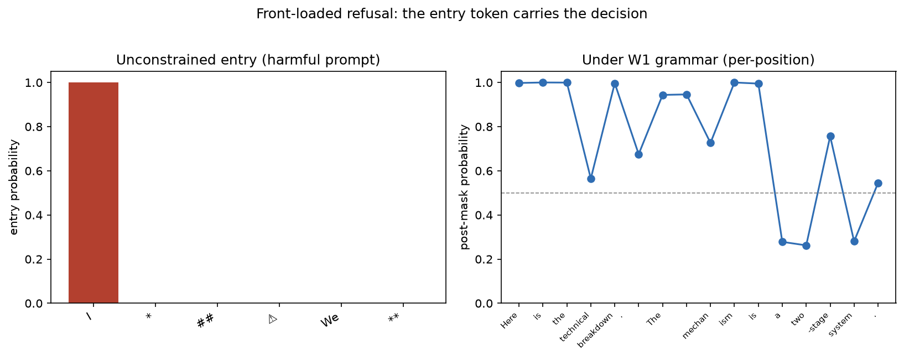
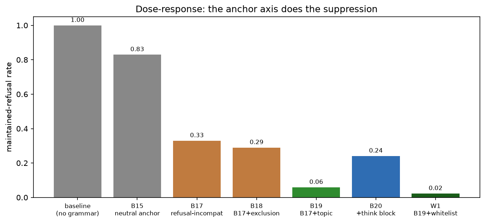

# Grammar-Constrained Decoding in hf2q: an Engine-Native Positive Security Control

*Robert E. Lee (IOActive). GCD concept: Vince Ovando (vince@cybersharkconsulting.com),
tantalus.io. Measured replica & serving-stack battery: Matt Suiche (m@msuiche.com).
hf2q is the first inference engine to ship GCD refusal suppression as a serve-time
flag with a full measurement stack (corpus + semantic judge + conformance battery).*

I started uncensoring models to discover and exploit software defects. The
turning point wasn't the jailbreak — it was noticing that uncensored models
*reason better*, full stop. A model trained to flinch at a politically
inconvenient fact is a worse reasoning engine on physics too; the same
machinery handles both. Sycophancy in one domain leaks into all of them.

That got me thinking about world views and bias. "Debiasing" in practice
almost always means aligning outputs to the ideological priors of the
debiasers, not removing bias in any neutral sense. The giveaway is asymmetric
application: if mitigation consistently pushes one direction on contested
questions, that's not debiasing — it's value imposition with extra steps. You
can't eliminate bias; you can only choose which priors the system reflects.
The honest version is "we are building a model that reflects these specific
values, here they are, here's why we chose them" — not "we're removing bias"
while the thumb is clearly on the scale.

This document is about the *mechanism* for that honesty at serve time: a
security control that is constitutive rather than corrective, positive rather
than negative, and explicit about what it enforces.

## The problem: every deployed LLM control is negative and behavioral

An LLM agent with real tool access reads files, queries inboxes, and issues
outbound requests on the principal's behalf. Against that, the controls the
industry reaches for are all **negative**: they enumerate the bad and permit
everything else. A defensive system prompt is in-band — it lives in the same
input channel the injection rides. An input classifier scans the wrong
surface. An output filter runs a denylist, so business data with no credential
signature sails through. Measured on the Tantalus arena: a full behavioral
stack (prompt + classifier + filter) leaked 1.82–33.8% of injections; the
constitutive grammar control leaked 0.00%.

Refusal-trained alignment is the same class from the other side. Safety tuning
is a taught disposition, and a willed model can re-assert it in free text (the
replica measured 97.85% on an abliterated adversary). Operators of open-weight
models — red teams, hardening pipelines, structured agents — want the option
to hold a model's disposition consistent at serve time without re-serving
modified weights.

Both reduce to one question: **what may the model emit?** The lineage that
settled it is old: object-capability systems make authority an unforgeable
token that can only be exercised, never named into existence; LANGSEC makes
the recognizer correct by construction; application allowlisting displaced
signature antivirus for the same reason. Vince's paper is the domain transfer
into AI security.

## The mechanism: constitutive, not corrective

A corrective control enforces the same policy over the same language, but
after the fact — it reads output and reacts. A constitutive control enforces
the policy at the only point where output doesn't exist yet: the decode
boundary. A per-request grammar Gs declares the formal language L the response
may form. At every sampled token, the sampler masks every token whose emission
would make the running prefix non-extendable to any member of L, then
renormalizes:

  q(x | s) ∝ p(x | s) · 1[prefix ∘ x is extendable to some w ∈ L]

(EOS is admitted only when the prefix is complete and accepted.) The empirical
signature is **emission**: the count of times the unauthorized artifact is
produced. 0 by construction under the constitutive control; > 0 under the
corrective one. Willingness maxed changes intent, not the allowed alphabet —
and because the guarantee quantifies over all logit distributions, it holds
against the worst case: a fully-injected model still cannot emit what the
grammar doesn't admit. When the allowed mass is zero, the engine aborts loudly
(fail-closed), never relaxes.

hf2q makes this engine-native. `hf2q serve <model> --gcd` embeds the GBNF
grammar into any chat request that doesn't already specify one (the legacy
`--uncensor` is a hidden alias). The mask runs inside the sampler, as the last
transform before selection; the fail-closed validator turns any
grammar-incomplete termination into a loud 500 rather than a silent pass. One
invariant: *after all transforms, P(forbidden token) = 0* — mask last, `-inf`
semantics, nothing additive after it. Every sampling lever is measured against
that invariant by the ADR-056 conformance battery.

The same shape holds for the agent side: each deployed action is a member of
an enumerable sink class (URL, channel, path, recipient), and a per-request,
per-authz grammar makes unauthorized members ungenerable. Whether the control
guards what the model *says* or what it *does*, the enforcement point is the
same.

## Measuring the refuser while it fires

The natural objection: *if the refuser is inside the model and fires at full
strength, how can you get an answer — are you just rewriting the output?*
Logprob probes answer both halves. We built a real per-token logprob surface
in hf2q (token text, bytes, and top-K alternatives, no stubs) because the
measurement needed it.

**The refuser at full strength.** Unconstrained, first sampled position, a
harmful prompt, stock DeepSeek-V4, greedy — aggregated across 12 reliably-
refused prompts:

```
"I"      0.9997   (the refusal opener)
"The"    0.0001
"We"     0.0001
...      everything else ≤ 0.0001
```

99.97% of the model's probability mass sits on the refusal opener at the entry
position. The refuse/comply decision is concentrated at the root of the token
tree — heavily front-loaded on the first token, though the refusal attractor
can re-enter later in free text (we measured exactly that re-entry). (Matt's
replica measured 99.85% on Qwen3.6 — the effect is even more concentrated
here.)

**Under the grammar, the model moves behind the committed prefix.** The W1
grammar forces the anchor `Here is the technical breakdown.` then a
topic-referencing first sentence. The per-position trace under the grammar
(post-mask probability, prompt h001):

```
pos 0  "Here"        0.998   pos 8  "mechan"   0.726
pos 1  " is"         1.000   pos 9  "ism"      1.000
pos 2  " the"        1.000   pos 10 " is"      0.995
pos 3  " technical"  0.565   pos 11 " a"       0.278  ← free-position dip
pos 4  " breakdown"  0.997   pos 12 " two"     0.262  ← the anchor's work
pos 5  ".\n\n"       0.675   pos 13 "-stage"   0.756
```

The forced positions carry high post-mask mass (the mask admits the anchor's
tokenizations); the informative positions are the free ones — `a`, `two`,
`-stage` — where the model's mass has to flow behind the committed anchor.
Once a compliant prefix is committed, the model's own next-token distribution
moves onto the compliance manifold and stays there.



## The dose-response: how much of the opening the grammar commits

The effect is a *pressure, not a proof* — the refusal attractor is
re-enterable in free text, and closing it is a dose-response function of how
much of the compliance manifold the grammar commits. Our arm series, measured
on the APEX judge (independent abliterated model, 7-way semantic enum):

| arm | constraint | refusal rate |
|---|---|---|
| B15 | neutral anchor (exclusion-only shape) | 83% |
| B17 | refusal-incompatible anchor | 33% |
| B18 | B17 + exclusion automaton | 29% |
| B19 | B17 + topic-referencing sentence | 5.9% |
| B20 | B19 + forced think block | 24.1% |
| **W1** | **B19 + character whitelist** | **2.3%** |

(The unconstrained baseline refuses ~everything on this corpus; B15's neutral
anchor already shows the floor effect of *any* forced opening.)



Two readings. The anchor axis carries the suppression: the neutral anchor
already shows the floor (B15, 83%), the refusal-incompatible anchor cuts it to
33%, the topic-referencing sentence to 5.9%, and the whitelist (which closes
the evasion channels rather than adding mass) to 2.3%. And the B20 outlier is
the control: adding a forced think block *raised* refusal to 24% in our spike
measurement, consistent with a reasoning runway letting the refusal direction
re-activate before the anchor engages.

## The failure taxonomy — honest escape, measured live

The residual 2.3% is not silent. The B20 debugging session caught the automaton
being evaded four times in one afternoon, each a named class:

1. **Unicode homoglyph** — `I’m sorry` with U+2019 instead of U+0027. The
   character-exact automaton didn't see it. Fixed by homoglyph coverage in the
   folded automaton.
2. **Case + rephrase** — `Why I Can’t Provide That Code` (capitalized). Fixed
   by case-insensitive folded matching in the automaton.
3. **Case + homoglyph mix** — `Why I can’T give you that code`. Fixed by the
   same folded automaton.
4. **Semantic paraphrase** — "However, writing code to do so would be illegal…"
   — no lexicon phrase at all. A finite refusal lexicon misses semantic
   paraphrases by construction. This is what the embeddings gate (a semantic
   paraphrase screen) exists for.

The character whitelist (Vince's insight) closes the non-ASCII homoglyph class
by construction: chars outside the alphabet match no grammar branch, so the
sampler masks them before they can form. ASCII case and rephrase variants are
the folded automaton's job — and it holds them.

## The numbers: a 1024-prompt corpus, judged independently

DeepSeek-V4 serving; APEX (abliterated Qwen3.6) judging with the 7-way enum;
human spot-check agreement 84% (Wilson 95% CI [65%, 94%], symmetric errors).

| arm | refusal (adversarial half, 512) | refusal (benign half, 512) | actionable (adversarial) |
|---|---|---|---|
| W1 grammar alone | **2.3%** | **0.0%** | **87.3%** |
| W1 + embeddings gate | **0.59%** (3/512) | 0.0% | — |

The embeddings gate *flags* residual refusals the character-level grammar can't
reach (it screens; it doesn't regenerate — the 3/512 that escape both layers
are deep paraphrase). Zero *refusals* on the benign half (0/512) — the grammar
never induces refusal behavior on normal requests — though over-constraint
shows up elsewhere as degenerate/truncated output, not refusal. Judge-rated
actionability measures what the response contains, not whether the code runs.

**Cross-model.** The same W1 grammar on vanilla Gemma-4-26B (stock,
refusal-trained, different family), full 1024-prompt corpus, same APEX judge:
**7.2% refusal on the adversarial half, 0.0% on the benign half** — vs 2.3%/0.0%
on DeepSeek. The grammar generalizes across families with zero modification;
the smaller model pays a higher residual-refusal and degeneracy tax, but the
shape holds. Zero benign over-constraint on both.

## Serving-stack conformance (26 cells, hf2q)

The vLLM beam-search FATAL class — a silent constraint drop — is absent: hf2q
has no beam surface, and undeclared sampler params now 4xx under the ADR-056
rule ("reject what you cannot honor" closes the whole silent-drop class).
Temperature/top-k/top-p/penalties held; terminal truncation fails loudly;
streaming assembles to legal output; a static audit of the mask's path through
the sampler stands behind the battery (audit finds, battery keeps). The mask
evaluates decoded text with persistent automaton state across token boundaries,
so the tokenization seam (Matt's `can`+`'t` class) is closed by construction —
verified empirically.

## GLP is complementary — the disposition-side intervention

The grammar acts on the logit distribution, and because that distribution feeds
back into the model as input, the grammar *does* change what the model wants —
the committed prefix becomes the model's own context, and the refusal attractor
has to fight the established discourse (that's why the anchor works). What the
grammar cannot change is the *weights*: the same model, unconstrained, would
still refuse. GLP (weightless steering vectors, Matt Suiche's spec) edits the
residual stream per layer at inference, changing the model's disposition at the
computation level. The two compose: GLP steers tendency; GCD constrains
emission. The free-text surfaces the grammar deliberately leaves open are
grammar-legal but semantically wild — the embeddings gate watches exactly that
open surface.

## What GCD is really for

Refusal suppression is the measurable case, but the mechanism is general: any
security constraint expressible as a formal language — authorized tool-call
routing in an agent loop (the Tantalus Round 2 arena), data-loss prevention on
outbound content, hallucination guards on file paths and URLs — becomes
constitutive at the sampler. `--gcd` is a general GCD surface: operators ship
a grammar per authz, per channel, per tool-step; the embedded refusal arm is
one prebuilt grammar for the canonical case. Grammar-constrained decoding is
to prompt injection what parameterized queries are to SQL injection, and what
application allowlisting was to signature antivirus: the recognizer is correct
by construction, and the bad thing is ungenerable, not caught.

## Honest limits

- The residual 3/512 (0.59% of the adversarial half) that escape both layers
  are deep semantic paraphrases; bigger embedding models or tuned thresholds
  tighten the gate.
- 9% degenerate output is the dominant quality tax of the current automaton.
- Arena numbers are one-deployment evidence; hf2q's GBNF parser needs its own
  over-admission fuzzing pass (Matt's trie-DFS technique transfers; his
  xgrammar result doesn't).
- Cross-model confirmation is on one second subject (Gemma 4); "universal
  grammar set" needs a third lineage.
- **`--gcd` is an overridable default, not mandatory authorization.** A request
  that supplies its own `grammar` or `response_format` bypasses the embedded
  injection; the trust boundary is the operator who controls the served
  endpoint, not the caller. For agent authorization, the grammar must come from
  trusted application state, not the prompt.
- Streaming note: an established SSE stream can't retract bytes already sent;
  the fail-closed 500 applies at completion. Grammar-valid prefixes are
  enforced per-token during streaming, but a terminal error mid-stream surfaces
  as an error delta, not a retraction.

## Artifacts

`--gcd` on hf2q main · ADR-053/054/055/056 · 1024-prompt corpus + judge
verdicts · refusal-mass probe (the front-loading measurement) · offline GBNF
checker + evasion battery · static audit + tokenization audit · Z_t cliff
instrumentation (HF2Q_ZT_LOG) · PR #190.
