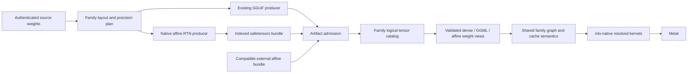

# MLX affine in hf2q: current support, missing contracts, and an efficiency-first implementation plan

Date: 2026-09-23. Status: source-grounded research and proposed implementation sequence; **not an implementation or a performance result**.

Governing decision: [ADR-046](../adr/ADR-046-evidence-driven-apple-auto-quant.md), Accepted. Its Phase C full-model affine artifact/runtime remains unimplemented. [ADR-020](../adr/diary/ADR-020-dwq-streaming-calibration.md) is Superseded and historical. [ADR-033](../adr/ADR-033-unified-quant-convert-pipeline.md) governs the current GGUF converter; [ADR-048](../adr/ADR-048-warning-free-release-boundary.md) governs production reachability.

## 1. Answer and objective

**hf2q does not currently provide production full-model MLX-affine conversion or inference.** It has a narrow legacy overlay, native packed-affine primitives, and evidence schemas that anticipate affine. Those pieces are not an end-to-end supported product.

The objective is **better measured Apple Silicon inference at acceptable model quality and memory use**, with conversion owned by hf2q and execution owned by Rust/`mlx-native`. Merely accepting an MLX directory would meet a compatibility milestone, not this objective.

Affine can create useful optimization opportunities: simpler group arithmetic, efficient packed QMV/QMM kernels, precision policies that retain quality at lower effective storage, and direct execution of compatible artifacts. It does not automatically outperform GGUF. The current GGUF path already uses Metal and unified memory, and has optimized matrix and expert kernels that the general affine path lacks.

Recommended direction:

1. Establish a validated packed-affine storage/arithmetic contract and small independent numerical fixtures.
2. Measure representative native matrix kernels before investing in broad family integration.
3. Deliver a complete source-to-artifact-to-inference Qwen3.8 dense text slice, including tools and prefix reuse.
4. Qualify additional bit widths, families, expert graphs, MTP and vision explicitly.
5. Make affine a measured candidate alongside GGUF. Do not select it by format name alone.

Baseline affine requires ordinary round-to-nearest quantization (RTN), **not DWQ training**. Dynamic precision allocation, AWQ, GPTQ and DWQ are algorithms/policies separate from the storage encoding. ADR-046 excludes DWQ training from its current implementation program.

## 2. Exact evidence boundary

| Source | Audited identity | What was checked |
|---|---|---|
| hf2q | `c6cce82088b368c7e66a89a2284ed57ff08e4125` | CLI, converter, backend, overlay loaders, family graph paths, cache keys, evidence admission, tests and ADRs |
| mlx-native | `f92eb020c4d3f821700e648fbce15d6cf75c2cc6`, published `0.15.1` | Loaders, capability API, Rust dispatch, Metal shaders, tests and benchmark harnesses |
| hf2q locked native dependency | crates.io `0.15.1`, checksum `76ce4c8d5773c72554a98020aadd330e566792dd27f843451ac5dd567bb6b5dd` | Registry VCS metadata names the audited native commit; all **311** registry `src/**/*.rs` and `src/**/*.metal` files compared byte-identical with the native checkout |
| Apple MLX | `59d600b5e64c238427d0f8d897ab7c682ef4d3d2`, upstream main snapshot, 2026-09-17 | Affine quantization, packing, numerical conventions and GPU route selection |
| Apple MLX-LM | `15bcf8b929e5da67aa7f8fe6feda7fb9eda00050`, upstream main snapshot, 2026-09-22 | Bundle writer/loader, per-module policies, Qwen sanitization, expert layers and learned-quantization taxonomy |

The upstream snapshots are research references, not claims about an installed runtime version. Public API documentation observed during research reports MLX 0.32.2. Source at the exact commits is the authority for implementation details below.

Performed: source/control-flow inspection, published-source comparison, and small host arithmetic checks for effective bits per weight and F16/BF16 bit interpretation. No project source code was changed by the investigation.

**Not performed:** compilation, Rust test execution, Metal execution, external MLX numerical execution, real-model conversion/loading, full-model quality, agentic serving or matched performance benchmarks. Source findings below are not presented as reproduced GPU failures. Existing test files are evidence of test design, not evidence that this session ran them.

Live project memory was searched; relevant affine implementation evidence was not returned. The coordination release-status key was absent through the available MCP route, which is not proof that the host is idle. No builds or model loads were dispatched.

The attempt to persist the completed research summary to coordination memory was refused by the memory tool because an active native WAL connection made its fallback whole-image write unsafe. Exact-key read-back confirmed nothing was stored. No database rewrite or repair was attempted; this report and the ADR amendment preserve the research independently of that memory write.

## 3. What “proper support” must mean

Four separate claims need separate proof:

| Claim | Required observable result |
|---|---|
| Artifact compatibility | Read/write a documented subset of MLX affine safetensors bundles, including mixed precision, logical dimensions, metadata dtypes, model config and tokenizer assets |
| Native inference correctness | Execute the artifact's actual packed values through every admitted graph route; no hidden dequantize/requantize or inconsistent prefill/decode weights |
| Product completeness | Conversion, local/managed loading, info/admission, generate, serve, tools, unary/SSE, cache reuse and invalidation work for each declared family/profile |
| Efficiency | Matched measurements show a useful speed/memory/quality tradeoff against current hf2q GGUF, with pinned upstream MLX execution as an additional implementation reference |

“Full model” means all required tensors in the explicitly admitted graph, including embeddings, output head, norms, recurrent/linear-attention state, routers and experts where applicable. It does not mean quantizing every tensor. Keeping selected tensors in F16/BF16/F32 is a valid explicit policy.

“All MLX affine” would currently imply upstream bits **2/3/4/5/6/8**, groups **32/64/128**, and applicable dtypes/shapes. An initial 4/6/8-bit subset is reasonable under ADR-046, but must be advertised as a subset. MXFP4/MXFP8/NVFP4 are different encodings, not affine profiles. [U-quantize]

## 4. hf2q's current conversion surface

### 4.1 No production affine producer

- `ConvertCliArgs` describes GGUF output and accepts GGUF/APEX/DeepSeek selectors. It exposes neither an output-container selection nor affine bit/group parameters. [H-cli]
- `QuantSelector` has GGUF/APEX/DeepSeek variants; `dwq` returns a reserved-selector error. [H-selector]
- `src/backends/mod.rs` declares only `gguf`, and explicitly records removal of the legacy safetensors writer in ADR-033 P6. [H-backends]
- The GGML `Quantizer` trait returns one GGML payload with a GGML tensor type. Affine produces a related set of packed codes, scales and biases. It is not another GGML tensor-type branch. [H-quantizer]
- `WeightEncoding::MlxAffine` exists in candidate receipts, but that is schema vocabulary. Current tensor-execution admission explicitly rejects `PhysicalTensorCodec::MlxAffine` and DWQ overlays. [H-candidate] [H-execution]

README's output-format table and backend directory description advertised an MLX writer that no longer exists. Those two descriptions are corrected with this research; this does not add a writer.

### 4.2 Reusable foundations, with limits

`HfModelSource` already supplies mmap-backed shard discovery, metadata planning, duplicate-name rejection and source-byte evidence; separate verified-source/provenance machinery binds trusted identities. Conversion already streams GGUF payloads and expert slices. Receipts already bind source identity and conversion decisions. The tokenizer/template resolver already handles source-bound chat assets. These are useful foundations. [H-source] [H-orchestrator] [H-receipt] [H-template]

However:

- Current source materialization can allocate one complete tensor as F32. An unusually large expert tensor can exceed the intended staging budget. Affine production needs row/group-range access, not merely one-shard-at-a-time access.
- The GGUF quantization helper intentionally performs **F32 → F16 → F32** before encoding for peer byte parity. Reusing it for affine would silently alter BF16/F32 source values. [H-orchestrator]
- GGUF BakeOps include layout changes, norm shifts, recurrent-parameter transforms and RoPE permutations. They belong to a specific graph/storage contract, not to quantization generally. [H-bake]
- The existing affine loader expands codes to U8; pack/serialize helpers consume that populated `MlxAffineLinear` representation and repack it. The helpers handle only 4/8-bit packing and appear in tests. They are useful fixtures, not a full-model producer. [H-affine-loader]
- Conversion `OutputReceipt` describes one file. A directory bundle needs a versioned identity covering its index, shards, config and required sidecars. [H-receipt]
- The hidden source-teacher command is a real fixed-profile quality-evidence entrypoint. The Dynamic allocator does not produce artifacts and its frontier search remains test-gated. Neither constitutes affine generation. [H-teacher] [H-dynamic]

## 5. hf2q's current inference surface

### 5.1 The overlay is not an MLX model loader

The public surface is `serve --dwq-overlay FILE` on top of a loaded GGUF. It expects hf2q-style `blk.N.*` overlay roles, not an ordinary MLX-LM model directory. `generate` does not expose this overlay. The metadata/config parsing helpers are not a connected full-model loader. No consumer of `mlx_native::QuantizedWeight` or `load_quantized_weights` was found in hf2q source/tests. [H-overlay-cli] [H-serve]

The dense overlay reader accepts rank-2 U32 codes at 4/8 bits, expands codes to U8 and scales/biases to F32. Upload then repacks codes and accepts **only 4-bit/group-32**. It stores affine metadata next to a fake `GgmlType::F32` sentinel. Shared dispatch selects the narrow packed affine QMM for every M, allocating a small Metal metadata buffer per operation. [H-affine-loader] [H-shared]

This is real affine arithmetic, but an unsuitable foundation for unrestricted imports: whole-file reads, expansion/repacking, sentinel typing, incomplete roles, and no optimized decode-versus-prefill selection.

### 5.2 Family/route coverage

| Family/operation | Actual current affine behavior |
|---|---|
| Gemma selected dense attention/FFN projections | Legacy overlay can replace these slots and use packed b4/g32/F32-metadata QMM |
| Gemma embeddings/head/router | Not covered by that overlay role matcher |
| Gemma MoE batched prefill | Reads affine expert slots when both fused gate_up and down stacks are present |
| Gemma MoE scalar decode, width-N and serial prefill | Reads original GGML expert stacks, not those affine slots |
| Native Qwen full-attention projections, dense FFN and head | Explicitly rejects affine overlay replacement |
| Qwen DeltaNet large projections | Stored/dispatched through existing GGML/dense structures; no full-model affine path |
| Qwen MoE experts | Legacy partial affine expert overlay exists; not a full-model artifact route |
| Qwen embedding and tied head | Explicitly rejects affine metadata |
| Qwen MTP shared head/dedicated embedding | Explicit affine rejection |
| DeepSeek-V4 | Dedicated GGUF path; no full-model affine consumer |
| Vision/projectors | No affine artifact/graph qualification established |

Sources: Gemma [H-gemma-overlay], [H-gemma-prefill], [H-gemma-decode], [H-gemma-width], [H-gemma-serial]; Qwen [H-qwen-overlay], [H-qwen-forward], [H-qwen-ffn], [H-qwen-delta], [H-mtp-head], [H-mtp-embedding]. Architecture admission remains family-specific; Qwen naming similarity is not a compatibility guarantee.

Optimized head-major native projection explicitly excludes affine. Its fallback permutes BF16 activations into F32 scratch before the older affine QMM. Packed weight storage alone therefore does not remove activation-layout/conversion overhead. Encoder/tree-verification helpers also need explicit codec audits. [H-projection] [H-tree]

### 5.3 Source-level correctness blockers

These must be reproduced by focused tests before fixes are claimed complete.

**Different Gemma MoE weights across execution regimes.** The public flag passes through `EngineConfig` and `LoadOptions` into Gemma `apply_dwq_overlay`. Expert overlay loading fills affine fields while retaining the original GGML stacks. Eligible HTTP requests use batched prefill, which reads affine stacks, then ordinary decode, which reads GGML stacks. Serial prefill and width-N also read GGML. This contradicts the comment that original expert buffers remain resident but unused. [H-overlay-cli] [H-serve] [H-engine-load] [H-gemma-overlay] [H-gemma-prefill] [H-gemma-decode] [H-engine-generation]

The immediate implementation gate is either consistent execution of one representation everywhere, or rejection of an unsupported overlay before activation. A successful load is not sufficient proof.

**Artifact identity does not bind overlay bytes.** Engine identity records overlay presence as a boolean. Persistent family LCP fingerprints use base-model provenance/template settings; they do not add overlay content identity. A changed overlay can therefore retain the same derived fingerprint. This is an identity omission, not a reproduced cache leak in this audit. Production affine must bind the exact executed bundle and effective policy. [H-engine-identity] [H-qwen-lcp] [H-gemma-lcp]

**Input validation is incomplete.** Legacy overlay metadata can default malformed numeric values; tensor loading computes divisions before proving nonzero/divisible group size. Expert bucket checks do not consistently prove full model expert count and shapes with release-mode errors. These are reasons to build strict admission, not copy the overlay into a public directory loader. [H-affine-loader] [H-shared] [H-qwen-ffn]

## 6. mlx-native: substantial primitives, incomplete production ABI

### 6.1 General packed-affine capability matrix at 0.15.1

The general API assumes **BF16 scales and biases**. Its I/O type is F32 or BF16; that does not describe metadata dtype. [N-capability]

| Operation | Accepted execution | Optimized coverage / missing work |
|---|---|---|
| Dense, F32 I/O | Scalar 4/6/8-bit | Row-wise SIMD 4/8-bit if N is divisible by 8, K by 256, and group layout satisfies the kernel |
| Dense, BF16 I/O | Scalar via F32 conversions for unmatched cases | Four-bit SIMD: K divisible by 512; eight-bit SIMD: K divisible by 256; N divisible by 8 |
| Expert by byte offset | BF16 I/O, 4/8-bit matching SIMD layout | No six-bit route or scalar fallback |
| Expert by ID buffer | F32 I/O, 4/6/8-bit | Scalar; no optimized routed QMM |
| Embedding gather | F32 output, 4/6-bit; width divisible by group size and packing unit (8 values for b4, 4 for b6) | Eight-bit gather missing |
| Prompt processing | Scalar or row-wise dense/expert execution | No specialized general packed-affine QMM |
| Width-N / verification | General multiple-row execution | No specialized general packed-affine width-N route |

Exact SIMD groups are powers of two that divide the block and are multiples of per-lane values: F32 4/8-bit uses groups 8–256; BF16 four-bit uses 16–512; BF16 eight-bit uses 8–256. These are low-level primitive capabilities, not permission to export arbitrary groups as standard MLX affine. Product interoperability should use the upstream supported set 32/64/128 and qualify each tuple.

The capability response correctly distinguishes `executable` from `specialized_for_regime`. Multiple rows through a QMV kernel are not an optimized QMM: the native shader rereads weights for each row. Six-bit falls back to scalar. Files named `quantized_matmul_mm*.metal` implement **GGML** formats; their names do not establish an affine QMM. [N-capability] [N-matmul-shader] [N-ggml-mm]

### 6.2 Separate packed QMM seed

`dispatch_qmm_affine_t_packed_simd4_b4` is a genuine packed-U32 matrix kernel: four bits, group 32, F32 activation/scales/biases/output, 32×32 output tiles, BK=32, four SIMD groups, partial M/N handling. This is the kernel used by hf2q's dense overlay. [N-qmm] [N-packed-qmm]

It is a useful starting point, but is outside the general capability matrix. It does not supply group64/128, BF16/F16 metadata, 6/8-bit packing, expert routing or device/shape-aware QMV/QMM selection. The other affine QMM variants primarily take unpacked U8 codes.

Two comments are stale: `qmm_affine.rs` says a packed variant is not implemented, and the packed shader describes an 8× saving over unpacked U8 codes. Packing four-bit codes saves 2× against U8 codes, or 8× against F32 weights, before scale/bias overhead. No native code/comment changes are made by this research.

### 6.3 Loader and dispatch contracts do not yet join safely

| Finding | Source-grounded consequence | Required change |
|---|---|---|
| Generic loader requires standalone `quantization_config.json` | Standard upstream bundles put authoritative quantization in `config.json`; a parsing helper exists but this loader does not invoke it | Explicit standard config/index admission |
| Globs every safetensors file and uploads all tensors before grouping | Unindexed/orphan/unused data can be uploaded; duplicates overwrite through map extension | Metadata-first catalog, duplicate/index checks, selective bounded transfer |
| Grouping discards scale dtype/shape and uses packed shape as logical shape | Returned `QuantizedWeight` can contradict its documented accessors | Validated logical/physical descriptor |
| Constructor validates nothing; config casts `u64` bits to `u8` | Malformed values can narrow, e.g. 260→4, or silently default | Checked typed parsing; strict mode and per-module policy |
| Loader preserves F16/F32 metadata; general kernels assume BF16 and mainly check lengths | Directly connecting the two can misinterpret bytes | Explicit metadata dtype in capability and dispatch; no silent narrowing |
| Embedding lacks weight/metadata/ID buffer-length and vocabulary-range checks | Shader directly indexes using token ID without a vocabulary bound | Validate lengths and defend ID range |
| Expert-offset API omits input-length/alignment checks | Buffer slicing contract is incomplete | Checked sizes/offsets/alignment |
| Invalid expert ID returns without writing output | Caller-owned `_into` output may retain old values | Defined error/status and output behavior |
| Expert stride/offset arithmetic narrows to 32 bits | Large expert tensors need checked rejection or 64-bit addressing | Wide checked addressing and >4 GiB tests |
| Packed QMM accepts caller GPU metadata separately from validated host dimensions | Shader dimensions can disagree with host buffer validation | Construct device metadata from validated parameters |

Sources: [N-weight], [N-matmul], [N-embedding], [N-embedding-shader], [N-expert], [N-expert-shader], [N-qmm]. These are source-proven missing checks and conditional consequences; no invalid-input GPU execution was attempted.

One host-only bit check illustrates why metadata dtype is essential: FP16 `1.0` has bits `0x3c00`; the same 16 bits interpreted as BF16 mean `0.0078125`. The existing loader test uses FP16 scales/biases but does not execute them through matmul. Byte-length success is insufficient. [N-weight-tests]

### 6.4 Numerical precision must be part of the ABI

The legacy scalar dense/routed affine shaders explicitly round activations and reconstructed weights to BF16 before F32 accumulation. SIMD uses grouped arithmetic, effectively `scale * dot(codes, x) + bias * sum(x)`, with BF16 activation conversion. The separate F32-metadata QMM has another contract. Consequently F32 I/O does not imply full F32 arithmetic, and route transitions are not automatically numerically identical. [N-matmul-shader] [N-matmul-tests]

Native decision D7 deliberately fixed BF16 materialization after measured M1/M5 disagreement. Do not remove that behavior as an incidental optimization. New routes need a declared precision contract, external reference fixtures, cross-generation proof and an amendment if that accepted behavior changes. [N-D7]

Six-bit packed GPU extraction itself matches the inspected upstream contiguous three-byte/four-code convention. The missing work is primarily fast routes, typing, integration and evidence; do not unnecessarily redesign a compatible packing scheme. [N-matmul-shader] [U-cpu]

## 7. The actual upstream affine contract

### 7.1 Storage and quantization are separate contracts

For logical `[N,K]` weights, standard affine storage has:

- `.weight`: U32 array with last dimension `K * bits / 32`;
- `.scales` and `.biases`: floating arrays with last dimension `K / group_size`;
- analogous leading expert dimensions for `[E,N,K]`;
- decoding `w_hat = code * scale + quantization_bias`.

The per-group `.biases` must not be confused with a Linear layer's optional additive `.bias`. Both can exist. Bit/group/mode defaults and module-path overrides belong in `config.json`; a module override is not simply a filename suffix heuristic. Standard index entries can place triplet components in different shards. [U-ops] [U-layers] [U-switch] [U-utils]

MLX uses groups 32/64/128 and supports 2/3/4/5/6/8 bits. Four/eight-bit packing is straightforward little-endian U32 packing; six-bit uses a continuous bitstream, equivalently four codes in three bytes. Do not implement `32 / bits` padded words for six-bit. [U-ops] [U-cpu]

### 7.2 Do not port only the simplified min/max formula

The public documentation explains affine quantization conceptually. Current source is more specific: it chooses a signed scale according to the larger-magnitude endpoint, floors the initial scale at `1e-7`, adjusts scale using a rounded endpoint ratio, records an endpoint-derived bias and casts metadata to the input dtype. CPU and Metal implementations must be independently checked for rounding/edge cases. [U-ops] [U-cpu] [U-metal-kernels]

Native `qdq_affine_init_f32` instead uses positive `(max-min)/(bins-1)`, bias=min, unpacked U8 codes and F32 metadata. This produces a valid affine representation but is not evidence of byte-identical current `mx.quantize`. [N-qdq]

Define the producer contract explicitly: exact compatibility with a pinned upstream quantizer where claimed, or a separately identified native affine RTN algorithm with measured quality. Storage compatibility does not require identical codes from different quantizers; **a claim of matching MLX quantization does**. Do not silently substitute algorithms.

Golden cases must include positive-only, negative-only, constant, zero, asymmetric extremes, near-half rounding, metadata cast boundaries and nonfinite handling. Decide which CPU/GPU reference is authoritative for artifact reproduction; do not assume they are byte-identical at every edge case.

### 7.3 Bundle and family interoperability

Pinned MLX-LM writes ordinary safetensors, `model.safetensors.index.json` with a complete `weight_map`, config, tokenizer and generation assets. It mirrors quantization defaults/overrides into `quantization_config`. Each individual safetensors tensor/component stays wholly in one shard; a logical affine matrix's weight/scales/biases may span shards. An oversized component can occupy one shard, and hf2q can stream ranges within that file without splitting the component across files. [U-utils]

Family sanitization is substantial. The inspected Qwen implementation moves Conv1D axes, conditionally adds 1 to norms, renames text-module prefixes, removes a tied duplicate head, and drops MTP and vision weights in its text path. MoE additionally adapts gate/up expert layout; routing gates receive eight-bit/group64 overrides. [U-qwen] [U-qwen-moe]

Therefore:

- Select and version an explicit raw-HF versus sanitized-MLX artifact layout.
- Apply every transform exactly once; test importing already sanitized models.
- Do not reuse GGUF row/column/RoPE/recurrent bakes blindly.
- An MLX-LM-compatible text artifact does not establish vision or MTP support.
- A first text-only milestone must require the existing explicit text-only choice for multimodal sources, rather than silently discard features.
- Preserve the exact tokenizer, template, special/added tokens, EOS/generation settings and required processors with hashes.

## 8. Efficiency: where a win can and cannot come from

### 8.1 Actual storage cost

For b-bit affine groups of G weights with scale and bias each d bits, payload cost is:

`effective bits/weight = b + 2*d/G`.

This excludes unquantized tensors, mixed precision, padding, file metadata, activation/KV state and runtime copies.

| Representation | Effective bits per quantized weight |
|---|---:|
| Legacy hf2q overlay: b4/g32, F32 scale+bias | **6.0** |
| Affine b4/g32, F16 or BF16 metadata | 5.0 |
| Affine b4/g64, F16 or BF16 metadata | **4.5** |
| Affine b4/g128, F16 or BF16 metadata | 4.25 |
| Affine b6/g64, F16 or BF16 metadata | 6.5 |
| Affine b8/g64, F16 or BF16 metadata | 8.5 |
| GGUF Q4_K block: 144 bytes / 256 weights | **4.5** |
| GGUF Q6_K block: 210 bytes / 256 weights | 6.5625 |
| GGUF Q8_0 block: 34 bytes / 32 weights | 8.5 |

The arithmetic was checked during this research; GGUF byte sizes are defined in the in-tree codecs. Q4_K_M is a mixed tensor policy, so its full-model size is not uniformly 4.5 bits/weight. [H-q4k] [H-q6k] [H-q8]

Consequence: simply replacing Q4_K with “four-bit affine” does not guarantee smaller weights. Group64 with 16-bit metadata has the same block storage cost as Q4_K. The legacy overlay is larger. Quality and other tensor policies decide the useful comparison.

### 8.2 Workload-specific opportunities

| Workload | Potential benefit | What can erase it |
|---|---|---|
| Single-token dense decode | Efficient group decode, low weight traffic, tuned QMV | Extra metadata, scalar fallback, casts, dispatch/synchronization overhead |
| Long-prompt prefill | Tiled matrix operations that reuse weights across tokens | Repeating QMV for each row; full dequantization temporaries |
| Several requests / short verification batch | Small-M weight reuse and tuned crossover | One kernel strategy for every M; repeated buffers/dispatches |
| MoE decode/prefill | Efficient selected-expert reads, grouped/sorted expert work | Scalar routed kernels, skew, bad down-projection layout, oversized addressing |
| Long-context agentic turns | Lower weight residency can leave more KV capacity; prefix reuse lowers prefill | Attention/KV bandwidth dominates, cache misses, family-specific state bugs |
| Startup/conversion | Streaming packed production/loading avoids expansion | Whole-model U8/F32 staging, all-shard uploads, duplicate GGUF+overlay state |

Apple MLX itself chooses different QMV, wide-QMV, split-K QMM and matrix routes according to shape/device. Its tensor-operation path also gates dtype/alignment. Those choices are useful design references, not proof their thresholds transfer to this Rust engine. [U-dispatch]

The candidate's lower-bound decode time depends roughly on bytes read divided by achieved memory bandwidth plus attention/other graph costs. Prompt processing additionally depends strongly on matrix utilization. Neither bound supplies a speedup percentage without measurements.

A six-bit representation can be smaller yet slower than eight-bit if six-bit uses scalar kernels and eight-bit uses SIMD. A calibrated four-bit model may beat a higher-precision alternative at comparable quality, but that benefit comes from the combined encoding, quantization policy and kernel implementation.

### 8.3 Existing benchmark evidence is insufficient

The native affine Criterion benchmark principally measures a scalar b4/M1 case. `bench_qmm_affine` compares local unpacked-U8 variants with per-call synchronization and average wall time. Packed-QMM tests compare local packed and unpacked paths; general tests commonly use native arithmetic oracles. These are useful development tools, not a matched full-model affine-versus-GGUF result. The Criterion benchmark returns without running when Metal is unavailable; the examined native GPU tests require a device, while `test_quantized_matmul.rs` is compiled only on Apple targets. Some hf2q overlay tests return early without Metal. Require nonzero executed cases. [N-bench] [N-qmm-bench] [N-matmul-tests] [H-shared]

**No source-bound result found in this audit demonstrates that switching current hf2q to affine improves its end-to-end performance.** The implementation plan below is designed to obtain that evidence early.

## 9. Proposed architecture and conversion design

### 9.1 One graph, explicit storage choices

Recommended boundaries:

- hf2q owns source/model identity, family mappings, quantization policy, artifact production, tokenizer/template, graph and serving/cache semantics.
- mlx-native owns validated packed-weight views, transfer/storage, primitive capabilities, numerical kernel contracts and scheduling mechanisms.
- Both artifact loaders produce the same family logical catalog. Avoid a second full inference graph merely because the storage container differs.
- Represent dense, GGML and affine matrices explicitly. Avoid fake GGML types and parallel optional fields whose meaning differs by caller.
- Kernel capability and dispatch must use the same validated descriptor/decision; do not keep a separate optimistic support table.

A packed-affine descriptor needs mode/version, logical shape, packed shape/row stride, bits/group size, exact code/scale/bias dtypes and views, expert count/strides, tied aliases and numerical contract. A resolved route additionally binds operation, M/N/K, activation layout/dtype, device capabilities, kernel identity and whether it is specialized for that regime.

### 9.2 Producer steps

1. **Classify the input.** Dense source → quantization; already affine → validated import/direct execution or explicitly authorized lossless repack; other quantized source → explicit supported handling or rejection. Never silently decode/requantize an imported model or count downloading one as hf2q conversion.
2. **Plan before allocation.** Enumerate the full family tensor catalog and choose canonical layout, dtype preservation, quantized modules, protected tensors, per-module overrides, tied storage, component sizes, shard placement and required execution regimes.
3. **Separate format, encoding and algorithm.** The output container is MLX-compatible safetensors; encoding is affine with a per-tensor profile; the first algorithm is RTN. GGUF ftypes and `dwq` are not the control surface for this.
4. **Quantize source rows/groups in bounded chunks.** Preserve BF16/F16/F32 source semantics. Generate packed bytes directly; no all-model U8 expansion or automatic F16 intermediate. If a source/metadata cast is an intentional recipe choice, bind it into artifact identity and quality evidence.
5. **Write deterministic shards.** Precompute safetensors headers and component offsets, stream code/scale/bias ranges, and keep each individual safetensors component wholly in one shard. A matrix's three components may span shards. A shard or component may exceed staging memory without requiring a full in-memory copy.
6. **Write interoperable configuration.** Standard defaults/module overrides and tensor names must work in the pinned upstream loader. Store richer hf2q provenance/capability receipts separately, with agreement checks against standard metadata.
7. **Publish only a complete bundle.** Stage output, validate every declared tensor/triplet/index entry and required sidecar, hash components, fsync, then use an explicit atomic completion/no-replace protocol. Interrupted conversion must not appear as a loadable complete artifact.

An illustrative **future, unimplemented** CLI is `hf2q convert SOURCE --format mlx --quant affine --bits 4 --group-size 64`. Exact spelling is secondary to separate typed format/recipe/policy domains and accurate managed-output receipts.

Suggested focused modules: affine policy/producer/codec adapter under `src/quantize/`, affine planner/driver beside the GGUF converter, indexed safetensors writer under `src/backends/`, and artifact admission/catalog adapters above family loading. Reusable low-level quantize/dequantize primitives remain in mlx-native under ADR-046's ownership boundary. Reuse authentication and stream/receipt conventions; do not grow the existing large legacy overlay files into the new subsystem.

### 9.3 Admission and inference steps

1. Inspect config, index and safetensors headers without allocating model weights. Reject unsupported family/mode, malformed numeric fields, inconsistent bits/shapes, missing/orphan triplets, duplicate names, unbound required tensors and unsafe shard paths.
2. Resolve each effective module policy and validate actual stored dtypes. Do not reinterpret F16/F32 metadata as BF16 or silently narrow it. Add supported native routes or reject the artifact.
3. Check every required operation/regime before upload: projection, embedding/tied head, full attention, recurrent projections, FFN, experts, width-N, chunked/resumed prefill and applicable adjuncts. A single accepted GEMM shape does not admit a model.
4. Transfer or map packed components with bounded transient memory and correct lifetimes/alignment. Preserve aliases and avoid duplicate full-model storage. Mapping versus copying is an implementation choice to measure; neither alone proves bounded total residency.
5. Make all family graph paths consume the typed representation. Remove bypasses that consult only a GGML type, and construct dispatch metadata from validated dimensions.
6. Bind bundle/policy/config/tokenizer/template/graph identities and activation-affecting settings into model/cache identity. Unchanged prefixes reuse family KV/recurrent state; incompatible identities miss or rebuild safely.
7. Extend `info`, local/managed artifact resolution, generate and serve only when the qualified path is complete. Hosted catalog admission requires bundle-aware identity and capability checks; do not label an arbitrary directory supported because a parser can open it.

## 10. Implementation sequence with falsifiable gates

These are proposed work packages, not completed phases or time estimates.

| Stage | Concrete deliverable | Exit evidence / failure decision |
|---|---|---|
| A. Numeric/storage contract | Validated descriptors, metadata dtype in capabilities, packing/numerical fixtures, focused current-overlay reproductions | Bad dtype/shape/IDs reject; external fixture agreement; current inconsistent overlays rejected or corrected |
| B. Performance spike | Representative packed b4/g64 QMV and tiled QMM using BF16/F16 metadata, exact shape inventory, current GGUF and pinned MLX controls | Numerical parity first; multiple-run matrix results across M; reformulate if no meaningful opportunity |
| C. Native runtime release | General validated packed loader/views, required embedding/head coverage, unified QMV/QMM route receipt, bounds/address checks | Native no-skip correctness and performance gates; published version required before hf2q integration |
| D. Rust producer and artifact | Bounded RTN affine writer, standard config/index, complete policy and bundle receipts | Rust output opens in independent loader; codes/scales/biases survive round-trip; interruption and memory-budget tests pass |
| E. First full vertical slice | Explicitly qualified Qwen3.8 dense text conversion/load/generation through the shared hybrid graph | Source quality, same-affine external parity, all prefill/decode/width-N transitions, tools/SSE/prefix reuse |
| F. Coverage expansion | Required 4/6/8-bit × group32/64/128 tuples, mixed policies, Gemma/Qwen MoE and other families | Separate family/regime proofs; routed down-projection, skew and large addressing; no silent feature omission |
| G. Measured selection | Affine execution lineage and quality/performance receipts integrated into candidate admission | Selector accepts only exact candidates that pass quality and workload gates; no auto activation from encoding labels |

Build order is dependency-driven. Numeric and kernel spikes can precede a complete producer using tiny independently generated fixtures. Conversely, a producer can be tested against an external reference before its production serving surface opens. The two lines join only on an exact artifact and a qualified graph.

The first efficient native tuple should target packed b4/group64 with compact metadata, with F16 and BF16 treated explicitly. Complete embedding/head policy may require eight-bit gather or explicit dense protection. Six-bit should receive a fast path before being promoted as a performance candidate; scalar executability is insufficient. Retain explicit rejection for 2/3/5-bit until those additional formats/regimes are implemented.

Qwen3.8 dense text follows ADR-046's existing first-family choice. It still includes hybrid attention/DeltaNet and all required tensor roles. Text-only is a staged scope, not permission to silently strip an owner's model features. MTP, vision and other families need their own mapping, artifact and correctness gates.

New native requirements land in isolated native work, are published and pinned, then consumed by hf2q. No ignored local Cargo patch can establish a reproducible landing. This research changes no dependency.

## 11. Required validation and benchmark design

### 11.1 Format and numerical proof

- Freeze small source tensors and packed artifacts from the exact upstream reference; retain source hash, dtype, bit/group policy and generator revision.
- Test codes, scales and biases independently, including sign of scale, constant/zero groups, six-bit cross-byte boundaries and source/metadata rounding edges.
- Exercise supported F16/BF16/F32 metadata explicitly; reject unsupported variants before upload. Test dense rank-2 and expert rank-3 shapes, all accepted bit/group tuples, ties and overrides.
- Test index/path membership, missing/duplicate/orphan tensors, triplets across shards, malformed config, invalid byte extents, interrupted publication and repeated deterministic conversion.
- Execute independent CPU/high-precision and pinned upstream matmul references; local packed-versus-local-unpacked equality alone cannot validate common mistakes.
- Cover every route transition around the measured QMV/QMM threshold, unaligned M/N tails, `_into` buffers prefilled with nonzero values, invalid IDs/offsets and addressing beyond 4 GiB.
- Specify numerical tolerances before comparison. Do not relax them to hide packing, routing or dtype mistakes; preserve the existing native D7 precision decision unless deliberately amended.

### 11.2 Family and serving proof

- Use raw-source and already-sanitized family fixtures to prove transforms occur once. Include Qwen Conv1D/norm/recurrent tensors, tied and untied heads, and exact expert count/coverage.
- Compare ordinary decode, serial/batched/chunked prefill, resumed prefix, width-N and applicable verification paths using one artifact. Trace the physical representation and resolved kernel for each required role.
- Check source-teacher quality independently from same-affine-runtime parity: an engine can faithfully execute an artifact that was quantized badly.
- Run a realistic coding conversation: correct tool name/arguments, tool-result continuation, follow-up edits, valid unary/SSE, actual first semantic token time, nonzero prefix reuse and cached-token counts.
- Test cancellation/retry, persisted cache restart, changed policy/artifact/template, concurrent conversations and isolation. Do not obtain compatibility by disabling cache reuse.
- Retain explicit unsupported errors for unqualified families/vision/MTP. Structural JSON validity without correct tool semantics is failure.

### 11.3 Matched efficiency experiment

Use three comparisons with different purposes:

| Comparison | Holds constant | Answers |
|---|---|---|
| hf2q affine vs pinned MLX on the **same affine artifact** | Codes/scales/biases, graph semantics, prompt/settings and device | Is native affine execution correct and competitive? |
| hf2q affine vs hf2q GGUF from the **same source** | Source model, held-out tasks, hardware/service settings; report actual quality/bytes for each artifact | Does the proposed feature improve this product? |
| Affine recipes/algorithms | Encoding/group/dtype where isolating algorithm effects; separate held-out evaluation | Does calibration or mixed precision improve the quality/size/speed frontier? |

GGUF and affine normally cannot contain identical quantized numbers under their respective codecs. Do not call a same-nominal-bit comparison “identical weights.” Compare at matched quality or report the quality/size tradeoff explicitly.

Representative matrix shapes must come from the exact family tensor inventory. Sweep M=1, short widths such as 2/4/8, values around route crossover, and prompt-sized batches. Include large FFN matrices, small routers, embeddings, vocabulary head, expert gate/up/down and realistic routing skew. Record GPU timestamps and wall time separately.

For whole models, report at least five measured runs after warmup, medians and dispersion:

- conversion time, peak staging/RSS and output bytes;
- cold/warm load time and peak allocated/resident memory;
- cold and cached semantic TTFT, cached-token counts, prefill and decode rates;
- width-N aggregate throughput and per-request latency;
- long-context memory and attention/cache cost;
- model quality, exact prompts/token streams, sampling, contexts, process residency, scheduler settings, hardware/OS/toolchain and source/artifact hashes;
- fallback routes and dtype conversions actually used;
- matched reference results and cleanup evidence.

Use the same attention/cache/scheduler configuration where the comparison is about weight kernels. Report energy only if measured; memory and token throughput do not by themselves establish energy efficiency. Do not co-reside large candidate/reference models or run through release-gate host contention.

A winner is a measured candidate satisfying the declared quality and workload contract. A microkernel speedup or successful artifact load alone does not make affine the preferred default.

## 12. Decisions that the research resolves, and remaining unknowns

Resolved by source inspection:

- There is no full-model affine producer/consumer to merely turn on.
- The native library has useful reuse opportunities; starting another private overlay runtime would duplicate incomplete machinery.
- Compact metadata, typed storage, a real prompt QMM and complete graph routing are central to the proposed efficiency benefit.
- The GGUF F16 round-trip and BakeOps cannot be reused blindly.
- Ordinary affine RTN is the first producer; DWQ is not a prerequisite.
- Full-model claims require bundle identity, cache correctness and operation-wide capability proof.

Still requiring experiments or implementation decisions:

- Whether affine wins the target family's quality/size/latency tradeoff against current GGUF.
- Which exact QMV/QMM crossover, tile and device route is best.
- Which source/metadata precision policy best preserves quality while enabling efficient kernels.
- Whether upstream CPU/Metal quantization differ on relevant edge fixtures and which reference contract to promise.
- Reproduction and repair of the legacy overlay and low-level validation findings.
- The incremental cost of family layout adaptation, MTP/vision and MoE routing.

Proceed with the smallest storage/numerical fixture and representative kernel spike, then a complete vertical slice. This tests the performance motivation early while building the artifact and inference contracts required to make any improvement reliable.

## Source references

hf2q, native and upstream source links below pin exact audited commits, so later refactors cannot silently change the evidence. hf2q was audited on the published graft feature branch at the identity above; the documentation landing is based on main `e7583e9363907d4491100178729226640dd9c8f6`. The relevant source differences were reviewed: graft additions do not supply affine conversion, change the audited affine kernel ABI, or close the listed affine graph/admission gaps. No graft implementation is included in this documentation change.

[H-cli]: https://github.com/robertelee78/hf2q/blob/c6cce82088b368c7e66a89a2284ed57ff08e4125/src/cli.rs#L461
[H-selector]: https://github.com/robertelee78/hf2q/blob/c6cce82088b368c7e66a89a2284ed57ff08e4125/src/convert/quant_selector.rs#L40
[H-backends]: https://github.com/robertelee78/hf2q/blob/c6cce82088b368c7e66a89a2284ed57ff08e4125/src/backends/mod.rs#L1
[H-quantizer]: https://github.com/robertelee78/hf2q/blob/c6cce82088b368c7e66a89a2284ed57ff08e4125/src/quantize/ggml_quants/quantizer.rs#L21
[H-candidate]: https://github.com/robertelee78/hf2q/blob/c6cce82088b368c7e66a89a2284ed57ff08e4125/src/intelligence/measured_auto_quant/types.rs#L45
[H-execution]: https://github.com/robertelee78/hf2q/blob/c6cce82088b368c7e66a89a2284ed57ff08e4125/src/core/provenance/tensor_execution/verify.rs#L418
[H-source]: https://github.com/robertelee78/hf2q/blob/c6cce82088b368c7e66a89a2284ed57ff08e4125/src/convert/source_reader.rs#L394
[H-orchestrator]: https://github.com/robertelee78/hf2q/blob/c6cce82088b368c7e66a89a2284ed57ff08e4125/src/convert/orchestrator.rs#L219
[H-receipt]: https://github.com/robertelee78/hf2q/blob/c6cce82088b368c7e66a89a2284ed57ff08e4125/src/convert/receipt.rs#L158
[H-template]: https://github.com/robertelee78/hf2q/blob/c6cce82088b368c7e66a89a2284ed57ff08e4125/src/core/chat_template_resolver.rs#L1
[H-bake]: https://github.com/robertelee78/hf2q/blob/c6cce82088b368c7e66a89a2284ed57ff08e4125/src/convert/arch/bake.rs#L41
[H-affine-loader]: https://github.com/robertelee78/hf2q/blob/c6cce82088b368c7e66a89a2284ed57ff08e4125/src/core/mlx_safetensors_loader.rs#L149
[H-teacher]: https://github.com/robertelee78/hf2q/blob/c6cce82088b368c7e66a89a2284ed57ff08e4125/src/main.rs#L467
[H-dynamic]: https://github.com/robertelee78/hf2q/blob/c6cce82088b368c7e66a89a2284ed57ff08e4125/src/intelligence/dynamic_allocator/mod.rs#L1
[H-overlay-cli]: https://github.com/robertelee78/hf2q/blob/c6cce82088b368c7e66a89a2284ed57ff08e4125/src/cli.rs#L1431
[H-serve]: https://github.com/robertelee78/hf2q/blob/c6cce82088b368c7e66a89a2284ed57ff08e4125/src/serve/mod.rs#L5097
[H-shared]: https://github.com/robertelee78/hf2q/blob/c6cce82088b368c7e66a89a2284ed57ff08e4125/src/serve/forward_mlx_shared.rs#L125
[H-gemma-overlay]: https://github.com/robertelee78/hf2q/blob/c6cce82088b368c7e66a89a2284ed57ff08e4125/src/inference/models/gemma4/model.rs#L1530
[H-gemma-prefill]: https://github.com/robertelee78/hf2q/blob/c6cce82088b368c7e66a89a2284ed57ff08e4125/src/serve/forward_prefill_batched.rs#L5331
[H-gemma-decode]: https://github.com/robertelee78/hf2q/blob/c6cce82088b368c7e66a89a2284ed57ff08e4125/src/inference/models/gemma4/gpu_full_attn.rs#L2435
[H-gemma-width]: https://github.com/robertelee78/hf2q/blob/c6cce82088b368c7e66a89a2284ed57ff08e4125/src/inference/models/gemma4/batched_body.rs#L1929
[H-gemma-serial]: https://github.com/robertelee78/hf2q/blob/c6cce82088b368c7e66a89a2284ed57ff08e4125/src/serve/forward_prefill.rs#L2474
[H-qwen-overlay]: https://github.com/robertelee78/hf2q/blob/c6cce82088b368c7e66a89a2284ed57ff08e4125/src/inference/models/qwen35/model.rs#L608
[H-qwen-forward]: https://github.com/robertelee78/hf2q/blob/c6cce82088b368c7e66a89a2284ed57ff08e4125/src/inference/models/qwen35/forward_gpu.rs#L800
[H-qwen-ffn]: https://github.com/robertelee78/hf2q/blob/c6cce82088b368c7e66a89a2284ed57ff08e4125/src/inference/models/qwen35/gpu_ffn.rs#L130
[H-qwen-delta]: https://github.com/robertelee78/hf2q/blob/c6cce82088b368c7e66a89a2284ed57ff08e4125/src/inference/models/qwen35/gpu_delta_net.rs#L467
[H-mtp-head]: https://github.com/robertelee78/hf2q/blob/c6cce82088b368c7e66a89a2284ed57ff08e4125/src/inference/models/qwen35/mtp_weights_load.rs#L147
[H-mtp-embedding]: https://github.com/robertelee78/hf2q/blob/c6cce82088b368c7e66a89a2284ed57ff08e4125/src/inference/models/qwen35/mtp.rs#L190
[H-projection]: https://github.com/robertelee78/hf2q/blob/c6cce82088b368c7e66a89a2284ed57ff08e4125/src/serve/native_projection.rs#L11
[H-tree]: https://github.com/robertelee78/hf2q/blob/c6cce82088b368c7e66a89a2284ed57ff08e4125/src/inference/models/qwen35/gpu_full_attn.rs#L1213
[H-engine-load]: https://github.com/robertelee78/hf2q/blob/c6cce82088b368c7e66a89a2284ed57ff08e4125/src/serve/api/engine.rs#L3647
[H-engine-generation]: https://github.com/robertelee78/hf2q/blob/c6cce82088b368c7e66a89a2284ed57ff08e4125/src/serve/api/engine.rs#L23763
[H-engine-identity]: https://github.com/robertelee78/hf2q/blob/c6cce82088b368c7e66a89a2284ed57ff08e4125/src/serve/multi_model.rs#L221
[H-qwen-lcp]: https://github.com/robertelee78/hf2q/blob/c6cce82088b368c7e66a89a2284ed57ff08e4125/src/serve/api/engine_qwen35.rs#L1683
[H-gemma-lcp]: https://github.com/robertelee78/hf2q/blob/c6cce82088b368c7e66a89a2284ed57ff08e4125/src/serve/api/engine.rs#L23060
[H-q4k]: https://github.com/robertelee78/hf2q/blob/c6cce82088b368c7e66a89a2284ed57ff08e4125/src/quantize/ggml_quants/q4_k.rs#L41
[H-q6k]: https://github.com/robertelee78/hf2q/blob/c6cce82088b368c7e66a89a2284ed57ff08e4125/src/quantize/ggml_quants/q6_k.rs#L33
[H-q8]: https://github.com/robertelee78/hf2q/blob/c6cce82088b368c7e66a89a2284ed57ff08e4125/src/quantize/ggml_quants/q8_0.rs
[N-capability]: https://github.com/robertelee78/mlx-native/blob/f92eb020c4d3f821700e648fbce15d6cf75c2cc6/src/affine_capability.rs#L149
[N-matmul]: https://github.com/robertelee78/mlx-native/blob/f92eb020c4d3f821700e648fbce15d6cf75c2cc6/src/ops/quantized_matmul.rs#L96
[N-matmul-shader]: https://github.com/robertelee78/mlx-native/blob/f92eb020c4d3f821700e648fbce15d6cf75c2cc6/src/shaders/quantized_matmul.metal#L44
[N-ggml-mm]: https://github.com/robertelee78/mlx-native/blob/f92eb020c4d3f821700e648fbce15d6cf75c2cc6/src/shaders/quantized_matmul_id_mm.metal#L1
[N-qmm]: https://github.com/robertelee78/mlx-native/blob/f92eb020c4d3f821700e648fbce15d6cf75c2cc6/src/ops/qmm_affine.rs#L588
[N-packed-qmm]: https://github.com/robertelee78/mlx-native/blob/f92eb020c4d3f821700e648fbce15d6cf75c2cc6/src/shaders/qmm_affine_t_packed_simd4_b4.metal#L25
[N-weight]: https://github.com/robertelee78/mlx-native/blob/f92eb020c4d3f821700e648fbce15d6cf75c2cc6/src/weight.rs#L623
[N-weight-tests]: https://github.com/robertelee78/mlx-native/blob/f92eb020c4d3f821700e648fbce15d6cf75c2cc6/src/weight.rs#L1194
[N-embedding]: https://github.com/robertelee78/mlx-native/blob/f92eb020c4d3f821700e648fbce15d6cf75c2cc6/src/ops/embedding.rs#L79
[N-embedding-shader]: https://github.com/robertelee78/mlx-native/blob/f92eb020c4d3f821700e648fbce15d6cf75c2cc6/src/shaders/embedding.metal#L44
[N-expert]: https://github.com/robertelee78/mlx-native/blob/f92eb020c4d3f821700e648fbce15d6cf75c2cc6/src/ops/quantized_matmul_id.rs#L222
[N-expert-shader]: https://github.com/robertelee78/mlx-native/blob/f92eb020c4d3f821700e648fbce15d6cf75c2cc6/src/shaders/quantized_matmul_id.metal#L114
[N-matmul-tests]: https://github.com/robertelee78/mlx-native/blob/f92eb020c4d3f821700e648fbce15d6cf75c2cc6/tests/test_quantized_matmul.rs#L8
[N-D7]: https://github.com/robertelee78/mlx-native/blob/f92eb020c4d3f821700e648fbce15d6cf75c2cc6/docs/flash-attn-train-decisions-2026-05-08.md#L278
[N-qdq]: https://github.com/robertelee78/mlx-native/blob/f92eb020c4d3f821700e648fbce15d6cf75c2cc6/src/shaders/qdq_affine.metal#L85
[N-bench]: https://github.com/robertelee78/mlx-native/blob/f92eb020c4d3f821700e648fbce15d6cf75c2cc6/benches/bench_quantized_matmul.rs#L63
[N-qmm-bench]: https://github.com/robertelee78/mlx-native/blob/f92eb020c4d3f821700e648fbce15d6cf75c2cc6/src/bin/bench_qmm_affine.rs#L12
[U-quantize]: https://ml-explore.github.io/mlx/build/html/python/_autosummary/mlx.core.quantize.html
[U-ops]: https://github.com/ml-explore/mlx/blob/59d600b5e64c238427d0f8d897ab7c682ef4d3d2/mlx/ops.cpp#L5005
[U-cpu]: https://github.com/ml-explore/mlx/blob/59d600b5e64c238427d0f8d897ab7c682ef4d3d2/mlx/backend/cpu/quantized.cpp#L1158
[U-metal-kernels]: https://github.com/ml-explore/mlx/blob/59d600b5e64c238427d0f8d897ab7c682ef4d3d2/mlx/backend/metal/kernels/quantized.h#L2623
[U-dispatch]: https://github.com/ml-explore/mlx/blob/59d600b5e64c238427d0f8d897ab7c682ef4d3d2/mlx/backend/metal/quantized.cpp#L1863
[U-layers]: https://github.com/ml-explore/mlx/blob/59d600b5e64c238427d0f8d897ab7c682ef4d3d2/python/mlx/nn/layers/quantized.py
[U-switch]: https://github.com/ml-explore/mlx-lm/blob/15bcf8b929e5da67aa7f8fe6feda7fb9eda00050/mlx_lm/models/switch_layers.py#L26
[U-utils]: https://github.com/ml-explore/mlx-lm/blob/15bcf8b929e5da67aa7f8fe6feda7fb9eda00050/mlx_lm/utils.py#L875
[U-qwen]: https://github.com/ml-explore/mlx-lm/blob/15bcf8b929e5da67aa7f8fe6feda7fb9eda00050/mlx_lm/models/qwen3_5.py#L346
[U-qwen-moe]: https://github.com/ml-explore/mlx-lm/blob/15bcf8b929e5da67aa7f8fe6feda7fb9eda00050/mlx_lm/models/qwen3_5_moe.py#L23
